# Term 4 Workbook - T4A1 Developer Workbook


## Question 13


```python
import random

class Car:
    def __init__(self, brand):
        self.car_name = brand

    def present(self):
        return 'I have a ' + self.car_name

class Model(Car):
    def __init__(self, brand, mod):
        super().__init__(brand)
        self.model = mod

    def show(self):
        return self.present() + ', it was made in ' + str(self.model)

makes = ["Ford", "Holden", "Toyota"]
models = []
for i in range(40):
    models.append(i+1980)

def random_int_from_interval(min,max):
    return random.randint(min, max)

for model in models:
    make = makes[random_int_from_interval(0, len(makes)-1)]
    model = models[random_int_from_interval(0, len(makes)-1)]
    my_car = Model(make, model)
    print(my_car.show())
```


### Comments on what the code snippets does on each line.

<b>Lines 1 - 8</b>

```python
import random

class Car:
    def __init__(self, brand):
        self.car_name = brand
        
	def present(self):
    	return 'I have a ' + self.car_name
```


**Line 1** - The import statement tells Python to search for the module named ```random```. The `random` module uses pseudo-random number generators for its various distributions. The module is found by the interpreter and a module object  called `random` is initialised. This module contains the function `randint` which will be used later in the code snippet for randomly selecting a make and model of a car.

**References**

https://docs.python.org/3/tutorial/modules.html


**Line 3** - This line creates a new class called `Car`. This is a blueprint for a new type of object and it enables objects of that type to be created.  No instances of `Car` can be initialised before defining the `Car` class so it is unsurprising that it is at the top of the file. Furthermore, classes usually have attributes and methods to give it functionality. The lines to follow give the `Car` class its functionality.

**References**

https://docs.python.org/3/tutorial/classes.html

https://realpython.com/python-main-function/


**Lines 4 and 5** - The `Car` class has the reserved`__init__` method. The `__init__` method is known as a constructor and when a new instance of the `Car` class is created, the `__init__` method is called so that the statements within the `__init__` method are executed. The `__init__` method is used to initialise the attributes of an object. In this case, the value of one instance variable is set in the `__init__` method. The instance variable is`car_name`and its value is set for just that particular instance by using `self`. 

The first parameter of a method is named `self` by convention. `self` is used to represent that particular instance of the class. Therefore by using `self.car_name`, the instance variable `car_name` is set for just that particular instance. The new car object has it's `car_name` attribute set equal to the value of the `brand` argument.

**References**

https://www.tutorialspoint.com/What-is-difference-between-self-and-init-methods-in-python-Class

https://www.geeksforgeeks.org/self-in-python-class/

https://www.journaldev.com/18397/python-class-init

https://micropyramid.com/blog/understand-self-and-__init__-method-in-python-class/

https://www.edureka.co/blog/self-in-python/


**Lines 7 and 8** - These lines define a method called `present`. The method is available to all instances of the `Car` class and classes derived from it. When called on a particular `Car` object, it concatenates 'I am a '  and the object's car name. It can get access to the object's `car_name` attribute by using the first argument of the method which is named `self`. After the strings 'I am a ' and `self.car_name` are concatenated, the resulting string is returned. In our case, if the car name was 'Holden', it would concatenate the two strings 'I am a ' and 'Holden', before returning the one string 'I am a Holden'. 

**References**

https://docs.python.org/3/tutorial/classes.html

https://www.geeksforgeeks.org/python-string-concatenation/


<b>Lines 10 - 16</b>

```python
class Model(Car):
    def __init__(self, brand, mod):
        super().__init__(brand)
        self.model = mod

    def show(self):
        return self.present() + ', it was made in ' + str(self.model)
```


**Line 10** - The lines define another class called `Model`. The `model` class is defined to inherit from the base class called `Car` which has previously been defined. Inheritance in Python means that attributes and methods in the base class are inherited into the derived class. In this example, the base class is `Car` and the derived class is `Model`, therefore the `Car`'s attributes and methods are available to be accessed by the `Model` class. Specially, the `Car`'s attribute `car_name` and method `present` are accessible to the `Model` class.


**Line 11** - The line has the method that initialises the `Model` object. The first parameter is `self` and refers to the particular instance of the model class that is being instantiated. There are two other parameters named brand and mod. 

**Line 12** - The super() function returns a temporary, proxy superclass object. In this case, the temporary object is of type `Car` and therefore gives the `Model` class access to the `Car` methods. The init method is then called on the `Car` object. This initialises the attributes of `Car`. The value of the `brand` attribute is passed to the`Car` class and is assigned to the `car_name` attribute. Since we inherit attributes from the base class `Car`, we can then access the `car_name` attribute from the `Model` class

**References**

https://realpython.com/python-super/

https://appdividend.com/2019/01/22/python-super-function-example-super-method-tutorial/


**Line 13** - The value of the `mod` argument is assigned to the `model` attribute within the `Model` class. This is done using the first argument of the `init` method which is called `self` by convention.  The first argument `self` represents an instance of the `Model` class. It allows us to assign the value of `mod` to the `model` attribute of this particular instance.

**Lines 15 and 16** - Here we have the `show` method. Since the `Model` class inherits from the `Car` class, we can call the `Car`'s `present` method, even though we are in the `Model` class. We access the `present` method by calling it on the first argument `self`. The present method, as mentioned in the Line 7 explanation, concatenates 'I am a '  and the object's car name before returning it as one string. Furthermore, the string concatenates with '', it was made in " and the string version of the `model` attribute. After being concatenated, the new concatenated string is returned. Eg. if the car name was Ford and the model was 1980, the show method would return 'I have a Ford, it was made in 1980'.


<b>Lines 18 - 24</b>

```python
makes = ["Ford", "Holden", "Toyota"]
models = []
for i in range(40):
    models.append(i+1980)

def random_int_from_interval(min,max):
    return random.randint(min, max)
```


**Line 18** - The `makes` variable is assigned a list of strings. It holds 3 strings that can be indexed by 0, 1 and 2 respectively. Each string represents a different kind of make and will be randomly chosen later in the code snippet.

**Line 19** - An empty list is assigned to the `models` variable. In the next two lines, the list will be populated with the integers 1980, 1981, 1982, ..., 2019.

**Line 20 and 21** - The `range` object can accept a start, stop and step value. However, in this case, only the stop value of 40 is provided, therefore, the start value defaults to 0 and the step value defaults to 1 because they were not specified. The `range()`object returns an iterator of integers which will be used to generate the integers from the start value, up to but not including the stop value. The start value is 0, the stop value is 40, and the step value is 1 so each integer from 0 to 39 will be generated one at a time. 

The `for loop` iterates through each integer generated by the iterator and assigns it to the `i` variable. Each time `i` is assigned a new integer, the statement within the `for loop` is executed. The sum of `i` and 1980 is appended to the end of the models list. Once again, the value of `i` is incremented and the sum of `i` and 1980 is appended to the end of the models list. This process repeats until the value of `i` reaches 39, then for the last time, the sum of `i` and 1980 is appended to the end of the models list.

**Line 23 and 24** - The `random_int_from_interval` function takes two arguments, the min and max. Both arguments must be numbers. The function will return a random integer between those two numbers, inclusive. 

In our case `random_int_from_interval(0,2)` will return either a 0, 1 or 2. The probability of returning each integer is the same. There are 3 different integers, therefore each integer has a 1/3 or 33.3% chance of being returned. 

Likewise, `random_int_from_interval(0,39)` will return either a 0, 1, 2, 3, ..., or 39. In this case, each integer has a 1/40 or 2.5% chance of being returned.

**References**

https://docs.python.org/3/reference/compound_stmts.html

https://www.geeksforgeeks.org/python-range-does-not-return-an-iterator/

https://docs.python.org/3/library/random.html


<b>Lines 26 - 30</b>

```python
for model in models:
    make = makes[random_int_from_interval(0, len(makes)-1)]
    model = models[random_int_from_interval(0, len(makes)-1)]
    my_car = Model(make, model)
    print(my_car.show())
```


**INTENTIAL TYPO**!!!!!!! Say what will happen because of the type and then say what it should be.

**Line 26** - The `for loop` iterates through each item in the `models` list and assigns the value to the `model` variable. The `models` list is populated with integers from 1980 to 2019. Therefore, the `mode`l variable will be assigned the value of 1980 during the first iteration of the loop, 1981 for the second iteration of the loop, and so on until it is assigned the value of 2019 for the final iteration of the loop.

**Line 27** - The `len(makes)` function returns the number of items in the `makes` list. There are 3 items so it returns 3. Therefore the `make` variable is going to be randomly assigned one of the strings in the `makes` list. It will be assigned to either "Ford", "Holden" or "Toyota". 

**Line 28** - The `len(model)` function returns the number of items in the `models` list. There are 40 items so it returns 40. Therefore the `models` variable is going to be randomly assigned one of the integers in the `models` list. It will be assigned to one of the integers between 0 and 39 inclusive.

**Line 29** - The `Model` class takes two arguments in order to instantiate an object. Those two arguments are `make` and `model`. Once the `model` object is instantiated, it's reference is assigned to the `my_car` variable. 

**Line 30** - The `show()` method is called upon the `my_car` object. The functionality of the show method is covered in the explanation of lines 16 and 17. Essentially, Those two arguments are `make` and `model`. Once the `model` object is instantiated, it's reference is assigned to the `my_car` variable.


## Question 12


**JSON** stands for **JavaScript Object Notation** and represents data in an unordered collection of key-value pairs, similar to a dictionary in python.

JSON can be **manipulated** by converting a JSON string into a python object  It can be done in a python file by using the `loads` method from the `json` module. 

Other features of JSON are that it is human-readable, widely used in other languages and by default can only represent a subset of Python built-in data types. 


### json.loads()  method

Here is an example of a **JSON string** being converted into a **python object** using the `json.loads()` method

```python
import json

sporting_interests = '{"name": "Michael", "sports": ["AFL", "Soccer"]}' # JSON string
sporting_interests_dict = json.loads(person) # Convert to python object

# Output: {"name": "Michael", 'sports": ["AFL", "Soccer"]} # Python object
print(sporting_interests_dict) 

# The python object is a dictionary 
# Output: ["AFL", "Soccer"]
print(sporting_interests_dict["sports"])
```


In the code above, `sporting_interests_dict` is a python object. We can change the contents of the python object and then convert the **python object** back into a **JSON string**.

 It can be done in a python file by using the `dumps` method from the `json` module. 


### json.dumps()  method

Here is an example of a **python object** having its contents changed and then being converted into a **JSON string** using the `json.dumps()` method

```python
# continued from the previous python code

# change the contents of the python object
sporting_interests_dict["sports"] = ["Badminton", "Basketball"]

# Output: {"name": "Michael", 'sports": ["Badminton", "Basketball"]} # Python object
print(sporting_interests_dict) 

sporting_interests = json.dumps(sporting_interests_dict) # Convert to JSON string

# Output: {"name": "Michael", 'sports": ["Badminton", "Basketball"]} # JSON string
print(sporting_interests)

```


Let's convert it back again to a **python object**

```python
# continued from the previous python code

# change the JSON string to python object
sporting_interests_dict = json.loads(sporting_interests)

```


We can write the new sporting interests to a file as **JSON**. 

### json.dump()  method

Below the `json.dump()` convert the python object to a **JSON object** and then writes it to a file called `new_file.txt`

```python
# continued from the previous python code

with open('new_file.txt', 'w') as json_file:
  json.dump(sporting_interests, json_file)

```


The JSON object is now located in the file called `new_file.txt`. We can exit our python program and the JSON object will still be left in the `new_file.txt` file. 

Here is a look at our file which contains the **JSON object**

```json
{"name": "Michael", 
"languages": ["Badminton", "Basketball"]
}
```


We can create a new program and run it to retrieve our **JSON object ** from the file.


We can read it in to our python file by using the `json.load()` method.

Here is an example of reading the **JSON object** from the file

### json.load()  method

Here is an example of reading the **JSON object** from the file using the `json.load()` method.

```python
import json

with open('path_to_file/new_file.txt') as f:
  data = json.load(f)

# Output: {'name': 'Michael', 'sports': ['Badminton', 'Basketball']}
print(data)
```


### Serialising python objects into a json format


Above the **load, loads, dump and dumps** methods were used to convert from **JSON** to **Python** and **Python** to **JSON**. They all dealt with **primitive Python types that have a direct JSON equivalent**. Sadly, the JSON encoder is limited in that it can **only serialize basic data types** such as lists, strings and numbers. 

An instance of a Python Class cannot be so simply encoded into JSON. Likewise JSON cannot be so easily decoded into an instance of a Python class.


### Serialising using JSONEncoder

Instead, what can be used is a **JSONEncoder**. The **JSONEncoder** has a `default()` method which defines how the object `o` is to be serialised. Whenever we execute `JSONEncoder.encode(object)`, the `default()` method will be used on any objects which are not natively JSON serialisable.

An easy way to encode an object is as a JSON object.

For example

```python
import json
from json import JSONEncoder

class Student:
    def __init__(self, name, age, location):
        self.name = name
        self.age = age
        self.location = location
        
# JSONEncoder
class StudentEncoder(JSONEncoder):
    def default(self, o):
        dictionary = o.__dict__
        dictionary["__student__"] = True # I include this so we know that the object type is student
        return dictionary

student = Student("Michael", 25, "Melbourne")
        
print("After being encoded, it will look like this")
print(StudentEncoder().encode(employee))

print(type(studentJSONData)) # Output: <class 'str'>
print(studentJSONData) # Output: {"name": "Michael", "age": 25, "location": "Melbourne"}
```


### Deserialising

We also can go backwards by decoding the JSON object back into a python object of type Student. In order to do this, we will just get the name, age and location values from the json object, use them to create a new Student object and return it.

The decode_student function will return the new Student object using the values from the JSON object.

```python
# continue from above code

def decode_student(dct):
    if "__student__" in dct:
        return Student(dct["name"], dct["age"], dct["location"])
    return dct


student_object = json.loads(studentJSONData, object_hook=decode_student)

print("Type of student object: " + type(student_object)) # Type of student object: <class '__main__.Student'>
print("Name: " + student_object.name) # Name: Michael
print("Age: " + str(student_object.age)) # Age: 25
print("Location: " + student_object.location) # Location: Melbourne
```


In summary, the json module has methods for manipulating data and storing it in a file as a JSON data type. JSON is human-readable and has directly equivalent data types in python. The code snippets above showed how it could be used with both primitive as well as custom data types.


**References**

https://realpython.com/python-json/

https://pynative.com/python-json/

https://www.programiz.com/python-programming/json

https://pynative.com/make-python-class-json-serializable/

https://docs.python.org/3/library/json.html


## Question 11


In Python, an **Object** is an instance of a class.  Therefore, before our **custom objects can be manipulated**, the classes need to be defined. **Classes** are the blueprints that are used in order to instantiate an object. Many instances can be created from the one class. Classes often have attributes including primitive data structures such as numbers, strings and lists. Also classes often have methods which have one or more parameters. These methods give the class functionality and the ability to **change its own attributes**.


### Initially set object attributes

Initially the **object's attributes** can be **set** by passing arguments into the constructor.


In our example, the **Animal class** takes the following arguments: name, age, vertebrate,  number_of_legs, can_fly.

The **Dog class** takes the following arguments: name, age, breed

The **Parrot class** takes the following arguments: name, age, color_feather


```python
class Pet():
    
    number_of_pets = 0
	
    def __init__(self, name, age, vertebrate,  number_of_legs, can_fly):
        self._name = name
        self._age = age
        self._vertebrate = vertebrate
        self._number_of_legs = number_of_legs
        self._can_fly = can_fly
        self.number_of_pets += 1
        
    def greeting(self):
        return "I am " + self._name + " and am " + self._age + " years old."
    
    def aged_a_year(self):
        self._age += 1
    
    @property
    def vertebrate(self):
        return self._vertebrate

    @property
    def number_of_legs(self):
        return self._number_of_legs
    
    @property
    def can_fly(self, x):
        return self._can_fly

    @vertebrate.setter
    def vertebrate(self, x):
        if type(x) == bool:
            self._vertebrate = x

    @number_of_legs.setter
    def number_of_legs(self, x):
        if x >= 0:
            self._number_of_legs = x
    
    @can_fly.setter
    def can_fly(self, x):
        if type(x) == bool:
            self._can_fly = x


        

class Dog(Pet):

    number_of_dogs = 0
    
    def __init__(self, name, age, breed):
        super().__init__(name, age, True, 4, False)
        self._breed = breed
        self.number_of_dogs += 1

    @classmethod
    def count(cls):
        return "The total number of dogs is " + str(cls.number_of_dogs) + "."

    @staticmethod
    def make_noise():
        return "bark! bark!"

    @property
    def breed(self):
        return self._breed

    @breed.setter
    def breed(self, breed):
        self._breed = breed


    

class Parrot(Pet):

    number_of_parrots = 0
    
    def __init__(self, name, age, color_feather):
        super().__init__(name, age, True, 2, True)
        self._color_feather = color_feather
    
    @staticmethod
    def make_noise():
        return "Sqwark! Sqwark!"

    @classmethod
    def count(cls):
        return "The total number of parrots is " + str(cls.number_of_parrots) + "."

    @property
    def color_feather(self):
        return self._color_feather

    @color_feather.setter
    def color_feather(self, color_feather):
        if type(color_feather) == str:
            self._color_feather = color_feather
        
        
```


### Manipulate object attributes

For **manipulating the object's attributes**, I have made sure that each of the classes have been defined with **setters**. Also, to verify that an **object has been manipulated**, I have **@property** annotations above methods that return the attribute value of the object. We can see what the attribute's value has been changed too.


Let's create **two objects** and **manipulate their attributes** by using **setters**. Also note that all the code is continued from the previous code snippet.

```python
polly = Parrot("Polly", 2, "Red")

charlie = Dog("Charlie", 4, "Golden retriever")

# Output is: "Initially, the Parrot's feather color is Red"
print("Initially, the Parrot's feather color is " + polly.color_feather) 


# Change the object's color_feather attribute to Blue
polly.color_feather = 'Blue'

# Output is: "Now, the Parrot's feather color has been changed to Blue"
print("Now, the Parrot's feather color has been changed to " + polly.color_feather)


# Change the object's color_feather attribute to Green
polly.color_feather = 'Green'

# Output is: "Again, the Parrot's feather color has been changed. It is now Green"
print("Again, the Parrot's feather color has been changed. It is now " + polly.color_feather)

```


Above, we see how the `color_feather` attribute was **manipulated multiple times**. 

Also, to ensure that it would be **manipulated to a string value**, there is an if condition that the new value must pass.

`if type(color_feather) == str:`


### Manipulating variables shared by all objects

Next, notice that the class variable `number_of_parrots` is **incremented** each time a new parrot object is created.

Likewise, the class variable `number_of_dogs` is **incremented** each time a new dog object is created.

Finally, the class variable, `number_of_pets` is **incremented** when either a new dog or new parrot is created.


```python

# Output: The total number of parrots is 1
print(Parrot.count())

# Output: The total number of dogs is 1
print(Dog.count())

# Output: The total number of pets is 2
print(Pet.count())


sunny = Parrot("Sunny", 2, "Red")
tweety = Parrot("Tweety", 8, "Grey")
coco = Parrot("Coco", 5, "Orange")

oscar = Dog("Oscar", 6, "Poodle")
ollie = Dog("Ollie", 4, "Beagle")


# Output: The total number of parrots is 4
print(Parrot.count())

# Output: The total number of dogs is 3
print(Dog.count())

# Output: The total number of pets is 7
print(Pet.count())
```


**Class variables below to all objects** so by changing the class variable we are also **manipulating an attribute shared by all of the objects**.


### Delete an attribute of an object

Another way to **manipulate** **an object** is to **delete one of its attributes**


```python
print("The color of coco's feather is ")
# Output: "Orange"
print(coco._color_feather)

# Delete the _color_feather attribute from the coco object
del coco._color_feather


print("The attribute has been deleted from the coc object. Let's verify that the attribute is indeed gone.")

# Output: AttributeError: 'Parrot' object has no attribute '_color_feather'
print(coco._color_feather)
```


### Delete the object itself

We can also **manipulate** **an object** by **deleting it**


```python
# Output: <__main__.Dog object at 0x7fa10fc97070>
print(ollie)

del ollie

# Output: NameError: name 'ollie' is not defined
print(ollie)
```


**References**

https://www.programiz.com/python-programming/class


## Question 10


An **array** stores multiple items in one single variable and the items it holds can be both indexed and manipulated. In Python, **an array of items that can be manipulated is called a** **list**. 

Here is an example of a list.

```python
colors = ['red', 'yellow', 'green']
```


### Append

The list can be **manipulated** by appending a new item to the end of the list.

Let's append the color 'blue' to the end of the `colors` list.

```python
colors.append('blue')

# Output: ['red', 'yellow', 'green', 'blue']
print(colors)
```


### Pop

The list can have its **last item removed** by popping it from the list.

Let's pop the last item in the **colors** list.


```python
colors.pop() # removes 'blue'


# Output: ['red', 'yellow', 'green']
print(colors)
```


Also a specific item within the list can be removed by using the pop method and **specifying its index position**.

Let's pop the item at the 1st index position.


```python
colors.pop(1) # removes 'yellow'


# Output: ['red', 'green']
print(colors)
```


### Insert

The insert method will insert a specified value into a specified index position within the list. 

The syntax `list.insert(i, elem)` means that the element `elem` will be inserted into the `ith` position. All the elements after `elem` are moved **one position to the right**.

Note that the index positions starts at 0.

Let's insert the color `'orange'` into the `1st` position. The items `'yellow'` and `'green'` will move one position to the right.


```python
colors.insert(1, "orange") # insert the string 'orange' into the 1st position in the list.

# Output: ['red', 'orange', yellow', 'green']
print(colors)
```


### Modify

Let's modify an item in the list. Instead of 'orange', lets change the color to be 'olive'. In order to modify the item 'orange', we need to **index it and also specify its new value**.

The syntax looks like **ListName[Index of item to modify] = new value** 


```python
colors[1] = "olive" # modify the element in the 1st position of the list to be the string 'olive'.

# Output: ['red', 'olive', yellow', 'green']
print(colors)
```


### Remove

The remove method will **get rid of the first matching element** in a list. It will look through the list from **left to right** and remove the first matching element. If there is no match, the remove method will raise a **ValueError** to signify that the value is not appropriate.

The syntax `list.remove(elem)` means that the first occurrence of the element `elem` will be removed. Also note that the method does not return any value.

Let's remove the first occurrence of the color `'yellow'`.


```python
colors.remove("yellow") # remove the first occurance of the string 'yellow' from the list.

# Output: ['red', 'orange', 'green']
print(colors)
```


### Sort

The sort method will sort the elements in a list. By default, strings are sorted in alphabetical order and numbers are sorted in ascending order. Also the reverse parameter can be set to true in order to sort in descending order.


```python
colors.sort() # sort the colors in alphabetical order

# Output: ['green', 'orange', 'red']
print(colors)

colors.sort(reverse=True) # sort the colors in descending order

# Output: ['red', 'orange', 'green']
print(colors)


numbers = [3,5,1,4,2]

numbers.sort() # sort the numbers in ascending order

# Output: [1, 2, 3, 4, 5]
print(numbers)

numbers.sort(reverse=True) # sort the numbers in descending order

# Output: [5, 4, 3, 2, 1]
print(numbers)

```


We can also pass our own key function as an optional parameter. This tells the function how to sort the elements of a list.

Let's sort a list by the length of each element.


```python
words = ['bathroom', 'phone', 'wardrobe', 'watch', 'kitchen']
words.sort(key=len)

# Output: ['phone', 'watch', 'kitchen', 'bathroom', 'wardrobe']
print(words)
```


Finally, be careful to check that all the items in the list can be compared. For example, **integers and strings are not comparable** using the default sorting function.


```python
items = ['bathroom', 1, 'wardrobe', 8, 'kitchen']

# Output: TypeError: '<' not supported between instances of 'int' and 'str'
words.sort()

```


### Delete

The delete method will **remove one or more items from the list by specifying their index**. Lets delete the items that are located at either index 1 and 2. 


```python
words = ['bathroom', 'phone', 'wardrobe', 'watch', 'kitchen']
del words[1:2]

# Output: ['bathroom', 'watch', 'kitchen']
print(words)
```


### Clear

The clear method will empty the list of all its items. It is equivalent to **deleting each and every item** from the list.


```python
words = ['bathroom', 'phone', 'wardrobe', 'watch', 'kitchen']
words.clear()

# Output: []
print(words)
```


 **References**

https://www.w3schools.com/python/python_arrays.asp

https://docs.python.org/3/tutorial/datastructures.html

https://www.programiz.com/python-programming/methods/list/remove

https://www.geeksforgeeks.org/python-list-remove/

https://datatofish.com/modify-list-python/

https://www.programiz.com/python-programming/methods/list/sort


## Question 9


In python, variables can store many **different datatypes**.

The following are some of the built-in data types.


**Numeric types**:		int, float, complex

**Sequences:** 			   list, tuple, string

**Mappings:** 				dictionary

**Set types:** 			     sets


### **Numeric types** 

These are different kinds of numbers such as **int**, **float** and **complex**.


An **int** is a positive or negative whole number, including 0. Numbers of type **int** **do not have a fractional part**.

In addition, **integers can be in a different base than 10.** For example, integers can be in base 2, 8, 16 and many others. In other words, integers can be formatted as binary, octal, hexadecimal or many other values.

```python
0b1001 # binary value. This is the same as the integer 9 in base 10.

0xaf # hexidecimal value. This is the same as the integer 191 in base 10

0o32 # octal value. This is the same as the integer 26 in base 10
```


A **float** is any **real number that** **does have a fractional part**. The factional part is denoted by numbers after a decimal point or by scientific notation. For example, **1.5** has a number after the decimal point so it is a **float**. **7.8925e3** is in scientific notation but is still a **float**. 

On almost all platforms, **Python floats have** **64 bit precision**. The maximum float number is about **1.8 x 10^308**. In other words, a float can have **307 digits** **before the decimal** and there is no problem. After the maximum float number, python will indicate the float value as **inf**. 

```python
# Output: 1.79e308
print(1.79e308)


# Output: inf
print(1.8e308)
```


Floats are also very precise. In computer hardware, **floating point numbers are approximated by using a sum of base 2 fractions**.

For example, here are some examples of how decimal fractions are represented as a sum of base 2 fractions


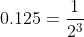


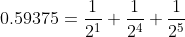


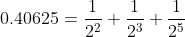


In general though the decimal floating-point numbers **can only be approximated by** the binary floating-point numbers.

For example,

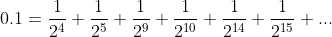

In base 2, 0.1 is the infinitely repeating fraction 0.00011001100110011001100...

**However there are only a finite number of bits that can be stored in memory**.

On most machines, **floats are approximated using the first 53 bits** starting from the most significant bit.

Therefore, the float value is only **accurate up until that 53th bit**.


For example, the true decimal value of the binary approximation stored for 0.1 is slightly off.


```python
>>> 0.1
0.10000000000000000555111512
```


To keep it manageable, Python just displays the rounded value


```python
>>> 1/10
0.1
```


**Complex numbers** have a real and an imaginary component. If a and b are real numbers and i is the square root of -1, then all imaginary numbers can be written in the form **z = a + bi**.


Let's create a complex number using the built-in `complex` class.

```python
# Initializing real numbers 
a = 7
b = -4
  
# converting a and b into complex number 
z = complex(a,b)

# Output is 7
print (z.real) 

# Output is 4
print (z.imag) 
```


**References**

https://realpython.com/python-data-types/

https://www.w3schools.com/python/python_datatypes.asp

https://www.geeksforgeeks.org/complex-numbers-in-python-set-1-introduction/


### Sequences

Lists, tuples and strings are all a kind of ordered **sequence**. A sequence is made up of elements and each one has an index value that can be used to access that particular element. The element at the first position is at index 0. the element at the second position is at index 1, and so on. Additionally, negative indexing can be used. The element in the last position is at index -1. the element in the second last position is at index -2, and so on. Below is an example of using both positive and negative indexes to access elements in a list.


**Positive indexes**

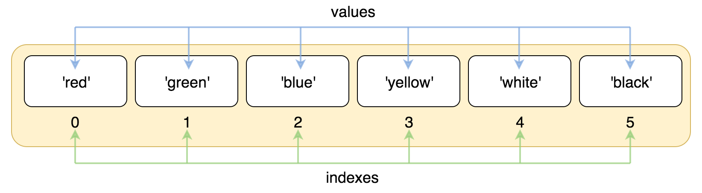


**Negative indexes**

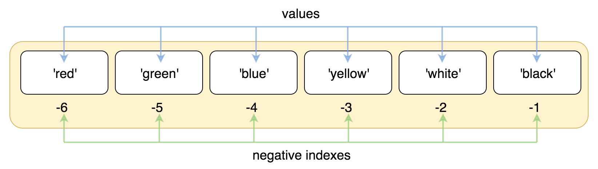

Images are from https://railsware.com/blog/python-for-machine-learning-indexing-and-slicing-for-lists-tuples-strings-and-other-sequential-types/


 Sequences can be iterated through by an iterator. This means that they can be looped through by a **for loop**.

Here are some examples of looping through sequences and using indexes.


```python
animal_list = []
# Loop through a tuple
for word in ("horse", "parrot", "dog", "cat"):
    # Manipulate a list by appending elements to it
	animal_list.append(word)

animal_string = ""
# Loop through a list
for word in animal_list:
    # Cannot manipulate a string so a new string must be created each time
    animal_string += word + " "

# Output: "horse parrot dog cat"
print(animal_string)

# Sequences can be sliced
# Output: "parrot dog"
print(animal_string[6:16])

# Sequences can be indexed 
# Output: "parrot"
print(animal_list[-3])


    
```


Additionally, the **membership operator** can be used to test if an item is in a sequence.

`x in my_sequence` will test whether the item x is a member of my_sequence. If x is a member of my_sequence, then `x in my_sequence` will evaluate to True. Otherwise, it will evaluate to False

For example, below we test whether an item is in a sequence.

```python

# Output: True
print(1 in  [1,2,3,4,5])

# Output: False
print(-3 in  [1,2,3,4,5])

# Output: True
print('g' in 'dog')

# Output: False
print('a' in 'dog')

# Output: True
print('horse' in ('parrot', 'horse', 'dog'))

# Output: False
print('ho' in ('parrot', 'horse', 'dog'))
```


**Lists** are a **mutable** type of sequence in that the elements of a list can be changed and a list can have its **length varied** through both appending and deleting elements. Syntactically, the elements in a list are comma-separated and are between square brackets.

For example

```python
my_list = ['Python', 'Java', 'HTML']
```

Lists can have elements of different types and the elements can be **modified** and **deleted**. 

Also new elements can be **appended** to a list.

For example,

```python
my_list[2] = 'CSS' # Modifies the 'HTML' element at index 2 to be 'CSS'

# Output: ['Python', 'Java', 'CSS']
print(my_list)


del my_list[1] # Deletes the 'Java' element at index 1

# Output: ['Python', CSS']
print(my_list)

my_list.append(12345)

# Output: ['Python', CSS', 12345]
print(my_list)


```


**Tuples** are similar to lists in that they are a sequence that contains elements. These elements can be any data types and the elements can be accessed through using their index. 

However, tuples are different to lists in that they are **immutable**, **cannot be copied** and are **not enclosed by** **square brackets**.

Unlike lists, tuples are a **fixed length**. 


```python
list_elements = ['AFL', 10, 'shop']
tuple_elements = ('Dog', True, 'Book', 'Ski')

# The list can be manipulated
list_names.insert(2, "beach")
del list_names[0]


# Output: [10, 'beach', shop']
print(list_names)


# A tuple cannot be manipulated
# Output: TypeError: 'tuple' object doesn't support item deletion
del tuple_elements[1]

# Output: TypeError: 'tuple' object does not support item assignment
tuple_elements[0] = 7


```


A **string** is a sequence of characters. Unlike lists, strings are **immutable**. This means that they cannot be altered once its declared.

Strings are usually surrounded by either single quotes or double quotes.

For example,

```python
text1 = 'The man went to the shop'
text2 = "The weather was sunny"
```


However, you can also use triple singe quotes or triple double quotes. This allows you to specify multi-line strings.

Also single and double quotes can be used whenever you like within triple quotes.

```python
text3 = '''The dog went for a walk.
			He had a nice time.'''
text4 = """I enjoyed the summer.
		   I often go to the beach."""
```


Strings cannot have their sequence of characters manipulated. Here are a couple of examples.

```python
# Output: TypeError: 'str' object doesn't support item deletion
del text[1]

# Output: TypeError: 'str' object does not support item assignment
text1[3] = "A"

```


**References**

https://www.w3schools.com/python/python_lists.asp

https://docs.python.org/3/tutorial/datastructures.html

https://www.tutorialspoint.com/python/python_lists.htm

https://www.geeksforgeeks.org/python-difference-between-list-and-tuple/

https://www.geeksforgeeks.org/python-set-3-strings-lists-tuples-iterations/

https://railsware.com/blog/python-for-machine-learning-indexing-and-slicing-for-lists-tuples-strings-and-other-sequential-types/

https://www.tutorialspoint.com/python/membership_operators_example.htm


### Mappings


**Dictionaries**

A dictionary is a data type which contains unordered **key-value pairs**. Unlike the sequences that were described above, dictionaries do not use a range of numbers to index its values. Instead, the **values** in a dictionary **are indexed by keys**. In a dictionary, each key is unique and each key maps to a particular value. Syntactically, the key-value pairs in a dictionary are comma-separated. A colon separates each key and its associated value. The collection of key-value pairs are enclosed by curly braces.

For example, here are key-value pairs in a dictionary. The key represents the country and the value represents its capital city.

```python
my_dict = {'Australia': 'Canberra', 'France': 'Paris', 'Spain': 'Madrid'}
```


Additionally, **the keys in a dictionary must be hashable**. Hashable means that an object can be represented by a fixed sized integer. Hashes are used to quickly compare dictionary keys during a dictionary lookup. However, **only immutable objects are hashable**.

```python
# Strings are hashable because they are immutable

hash_value_of_Australia = hash('Australia')
hash_value_of_France = hash('France')
hash_value_of_Spain = hash('Spain')

# Output: 4156992666677561458
print(hash_value_of_Australia)

# Output: -4276661290130737973
print(hash_value_of_France)

# Output: -395462626015495190
print(hash_value_of_Spain)
```


**Strings**, as previous mentioned, are immutable so they **can be used as keys** in dictionaries. However, **lists** are mutable, so they **cannot** be keys in a dictionary.

```python
# Output: TypeError: unhashable type: 'list'
my_dict2 = {['item1', 'item2']: 4}
```


Instead, we could use a tuple, which is immutable, and therefore hashable.

```python
my_dict2 = {('item1', 'item2'): 4}

# Output: 4
print(my_dict2[('item1', 'item2')])
```


The values in a dictionary can be updated by simply assigning a new value to an existing key. Also key-value pairs can be deleted by just specifying the key of that key-value pair.

```python
my_dict3 = {'A': 'Apple', 'B': 'Banana', 'C': 'Carrot'}

# Assign a new value to the key 'A'
my_dict3['A'] = 'Almond'

# Delete the key-value pair 'B': 'Banana'
del my_dict3['B']

# {'A': 'Almond', 'C': 'Carrot'}
print(my_dict3)
```


**References**

https://realpython.com/iterate-through-dictionary-python/

https://realpython.com/python-data-types/

https://docs.python.org/3/glossary.html#term-hashable

https://docs.python.org/3/tutorial/datastructures.html

https://docs.python.org/2/faq/design.html#how-are-dictionaries-implemented


### Set types


**Sets**

A **set** is a collection of **unique elements** that are **unordered**. The elements of a set may be of different types but those types must be hashable. As previously mentioned, only immutable items are hashable. This means that **sets cannot accept data types that are mutable** like a list. Also any duplicate items in a list are automatically ignored.

```python
# Output: TypeError: unhashable type: 'list'
vowels = {'a', 'e', ['i', 'o', 'u']}


# We try to enter duplicates into a list but the set automatically ignores them
vowels = {'a', 'e', 'e','e','i','i', 'o', 'o', 'u'}

# Output: 5
print(len(vowels))

# Output: {'o', 'u', 'i', 'e', 'a'}
print(vowels)
```


Sets can contain different but immutable data types.

```python
# Contains multiple different data types
set1 = {"house", 12, True, 2.3, "cat"}

```


Sets are **unordered** so we **can't index** them

```python
# TypeError: 'set' object is not subscriptable
print(vowels[1])
```


Sets also have their own **set operations** like union, intersection, symmetric difference and difference.

Here are the symbols used in python to do these set operations:

**Union symbol:    |**				**Intersection symbol:    &** 

**Symmetric difference symbol:    ^**				**Difference symbol:    -** 


For example, we can have a set of student names who study Maths and a set of student names who study English. We can perform set operations on the two sets.

Here are some examples of using the set operations.

```python
maths_set = {'Anna', 'Brian', 'Cameron', 'David'}
english_set = {'Brian', 'David', 'Joe', 'Nick'}


# Find students who study Maths but not English. This can be found using the difference symbol: -
# Output: {'Cameron', 'Anna'}
print(maths_set - english_set)


# Find students who study both Maths and English. This can be found using the intersection symbol: &
# Output: {'David', 'Brian'}
print(maths_set & english_set)


# Find students who study Maths or English or both. This can be found using the intersection symbol: |
# Output: {'Nick', 'Anna', 'David', 'Brian', 'Joe', 'Cameron'}
print(maths_set | english_set)


# Find students who only study Maths or who only study English but do not study both. This can be found using the symmetric difference symbol: ^
# Output: {'Nick', 'Anna', 'Joe', 'Cameron'}
print(maths_set ^ english_set)


```


**References**

https://www.programiz.com/python-programming/set

https://www.w3schools.com/python/python_sets.asp

https://www.geeksforgeeks.org/python-set-operations-union-intersection-difference-symmetric-difference/

https://snakify.org/en/lessons/sets/


## Question 8


**Type coercion**  is the implicit conversion of a value from one data type to another data type. It occurs where operands of an operator are of different types and **one operand needs to be automatically converted to an “equivalent” value** of the other operand’s type. 


Python is a programming language that **does not have type coercion**. Implicit conversion from one object to another cannot occur in the Python language.

For example

```python
model = 'IPhone'
version = 3

# Output: TypeError: can only concatenate str (not "int") to str
print(model + version)
```


Instead, we need the number to be **explicitly converted** to a string before using the + operator.


```python
model = 'IPhone'
version = 3

# We need to explicitly convert the number 3 to the string '3' before using the + operator.
# The str function can be used to convert the number 3 to the string '3'

# Output: 'IPhone3'
print(model + str(version))
```


**Type coercion exists in the JavaScript language** so lets do some examples. Lets print to the console some maths operations in the JavaScript language that use a string and an integer as its operands.

```javascript
console.log('2' - 2) // Output is 0. The string '2' was coerced to the number 2.
console.log('2' * 2) // Output is 4. The string '2' was coerced to the number 2.
console.log('2' / 2); // Output is 1. The string '2' was coerced to the number 2.
console.log('2' + 2); // Output is '22'. The number 2 was coerced to the string '2'.
```


All the maths operations above **require two arguments of the same data type**, however one value is a string and the other is an integer. This is why one value must be **automatically converted** from one data type to another in order to make the maths operation work. JavaScript did this **type coercion** internally.


For example, when using the + operator with one number and one string, JavaScript internally coerces the number to become a string.

```javascript
// number,string
console.log(36 + 'dog'); // Output is '36dog'. The number 36 was coerced to the string '36'.
```


Indeed, whenever using the + operator with one string and another data type, JavaScript internally coerces the string to become an integer.

```javascript
// boolean, string
console.log(true + 'cat'); // Output is 'truecat'. The boolean value true was coerced to the string 'true'.

// string, null
console.log('Three' + null); // Output is 'Threenull'. The null value null was coerced to the string 'null'.
```


Here are a few more examples of coercion when using comparison operators.

```javascript
'4' <= 3 // Output is false. The string value '4' was coerced to the number 4

false < 5 // Output is true. The boolean value false was coerced to the number 0

null < 3 // Output is true. The null value of null was coerced to the number 0
```


**References**

https://python-reference.readthedocs.io/en/latest/docs/functions/coerce.html

http://faculty.salina.k-state.edu/tmertz/Java/041datatypesandoperators/07typecoercionandconversion.pdf

https://www.pythonmorsels.com/topics/type-coercion/#:~:text=Numeric%20Types%20and%20Coercion&text=Python%20did%20not%20coerce%20the,objects%20to%20add%20themselves%20together.

https://dev.to/ahmedtahir/what-is-type-coercion-in-javascript-4l96


## Question 7


**Control flow ** is where different blocks of code are executed based on whether a condition is true or false. 

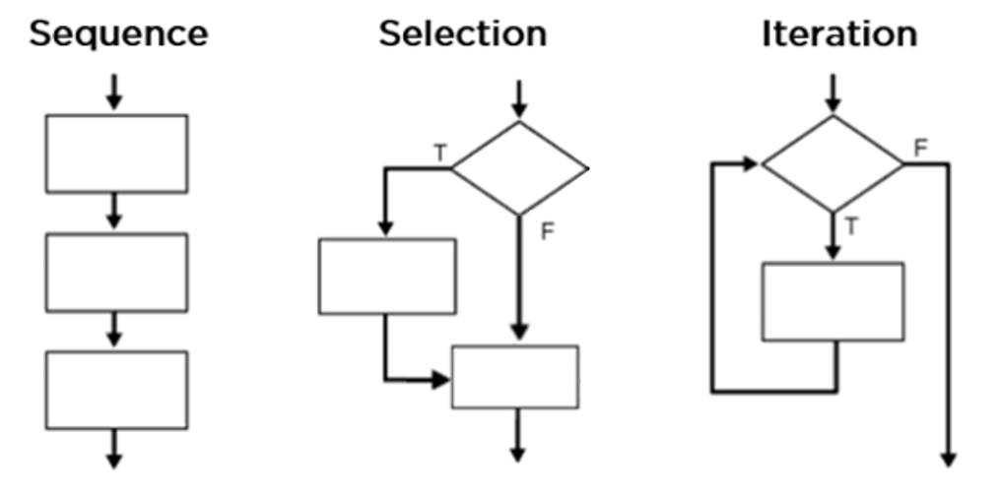

Image is from the site https://core-electronics.com.au/tutorials/control-structure-python.html


### Sequence

**Without control flow**, a program would just be a list of statements that are **always executed in the same sequential order**, regardless of the variables values. Visually this looks like the flowchart on the left. The code blocks would predictably follow one after another without needing any decisions to be made or any conditions to be evaluated. 


### Selection

The selection control structure allows one block of code to be executed if a condition evaluates to true, and another block of code to be executed if a condition evaluates to false. In the middle flow chart, a condition is evaluated in the diamond shape and the program takes one of two actions depending on whether the condition evaluated to true or false. The middle flowchart represents a **selection control flow** and is implement in Python using the **if-else statement**. 

For example, below the question is asked whether the age is at least 18. If true, the person can enter the pub. If false, they cannot enter.

```python
age = 21
if age > 18:
	print("Welcome to the pub")
else: 
	print("Sorry, you are under the age limit")
```


The condition ` age > 18` will evaluate to either true or false depending on the value of age. If it evaluates to true then one block of code is executed, specifically line 3. Otherwise, line 5 is executed.


Moreover, there can be several conditions and several branching statements. In Python, this can be done through using a if-elif-else statement. There must be one if condition but there can be many elif conditions. The final else part is optional.

Here's an example of using multiple elif conditions. Each condition is checked one at a time from top to bottom. Once a condition evaluates to true, all the remaining conditions below it are ignored.

```python
age = 15

if age < 0 or age > 120:
	print("Please enter a valid age")
elif age < 13:
	print("You are a child")
elif age < 20:
	print("You are a teenager")
elif age < 30:
	print("You are a young adult")
elif age < 65:
	print("You are a mature adult")
else:
	print("You are a senior citizen")
    
# The output is "You are a teenager". The remaining conditions are ignored.
```


### Iteration

Another way of controlling the flow of code is by using **iteration**. An iteration structure is where a block of code is repeatedly executed as long as a condition holds true or until the end of an iterable object is reached. Once the condition becomes false or the end of the iterable object is reached, the program exits the loop and moves down to next part of code.

For example, below the question is asked of how many bottles are on the wall. If the answer is greater than 0, then the code within the while loop is executed. The condition is checked again and the code is run again. This repeats until the condition evaluates to false. This is known as a **while loop**.


```python
bottles = 100

while bottles > 0:
	print("Keep removing bottles from the wall")
	bottles -= 1
```

  

Also a **for loop** is another example of iteration. The code within the for loop will be executed again and again until the sequence is exhausted and there are no more items left that have not been iterated through.


```python
for number in [1,2,3,4,5,6,7,8,9,10]:
    print(number)
```

 


**References**

https://jakevdp.github.io/WhirlwindTourOfPython/07-control-flow-statements.html

https://core-electronics.com.au/tutorials/control-structure-python.html

http://anh.cs.luc.edu/handsonPythonTutorial/loops.html


## Question 1


Below I provide an extensive **overview of the** **source control process** I follow when coding new projects. 

### Problems that source control addresses

Before I begin, the problem that source control addresses should be explained. In a development team, multiple developers are working on the one project. They often want to make frequent changes to the project's code and want to repeatedly update the project with the new code they have written. Soon, many revisions of the code are made and some developers may try to change the same lines of code in a file but in different ways. This will lead to a conflict which must be resolved. Also it is hard to keep track of what the most up-to-date version of the project is since many developers are working on it at the same time. Many changes to the code are made by different developers and it soon can become very complex. Additionally, a developer may want to revert back to a previous version of the project or see what changes another developer made to his code. This can quickly become very disorganised and hard to track.

A source control system is needed. The **system keep tracks of all the changes being made to the project** over the development process. Also, the tasks that each developer does can be separated through them having their own **branches to work on**. The management system allows each developer to isolate their work from other developers by working on their own branch. The **source of truth for the project is kept on the main branch**. Also to be able to effectively collaborate on the project, a remote repository can be hosted on the internet so that all developers can see the project latest updates. Once a developer's new code is ready to be saved to the main branch, they can commit and merge their code onto the main branch and push it to the remote repository. This way, all the other developers can see their latest code.

**Conflicts** can occur when merging code from a developer's own branch on to the main branch. For example, a conflict arises because a file was deleted on the main branch but was edited on a developer's branch and now that developer now wants to merge his/her work onto the main branch. Another conflict example could be that one developer made an edit to a line in a file and merged it on the main branch and now another developer wants to merge a different edit to the same line in the same file. In both cases, there is a conflict that must be resolved. 


### Create Git repository

Before I start going through conflict resolution, I will go through creating a new project using a popular source control version called **Git**. The files for a particular project should all be stored in the same location. This is what a **repository** will allow us to do. Git repositories can be stored on **many websites that provide the git version control software**, these include GitLab, Beanstalk, PerForce and others. I will use the popular site called **GitHub**. This is where I will store the repository for my new project so that other developers can access it. The repository will **manage and store all the revisions of the project**. 


 I first wish to go through how I **set up my repository** for my project.

As mentioned, I use **GitHub** so the code below is specific to setting up a repository in GitHub. I create a new repository for my new project by logging into my GitHub account and clicking the plus button on the top right hand side of the page.

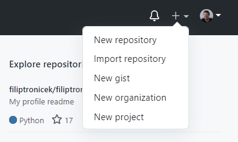

The drop down menu has the option *New repository*. Click that option. In the *Create a new repository* page, give the repository a name. In this example below, I enter the name *my_new_repo*. After having entered a name for the new repository, click the green button *create repository* which is located near the bottom of the page .

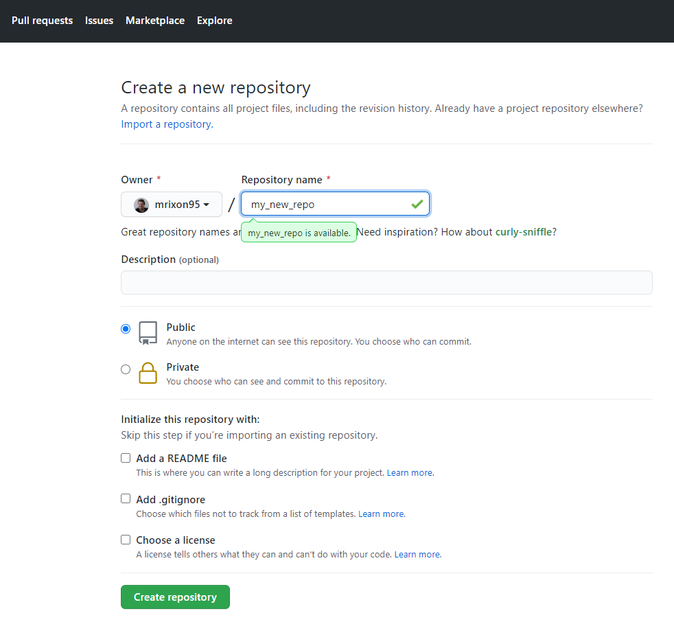

Once you have clicked the button *Create repository* you will be redirected to a page with instructions on how to push your new repo to GitHub. We do not yet have a local repository so we must follow the first section of instructions. The first set of instructions look like this.


Each of these commands must be run in a terminal application. Below is an image of the commands each run in my wsl terminal application. 

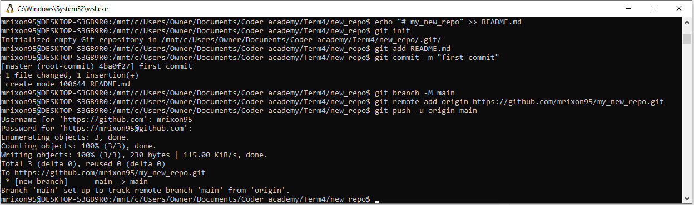

```bash
echo "# my_new_repo" >> README.md
git init
git add README.md
```

**Lines 1-3**

Firstly, the string "# my_new_repo" is appended to a new markdown file named README.md 

A new, empty repository is created using the git init command.

The git repository has been created, so we can now add the file named README.md to the repository's staging area. By running git add on README.md, the repository now tracks the file and prepares it to be committed. 


```bash
git commit -m "first commit"
git branch -M main
git remote add origin https://github.com/mrixon95/my_new_repo.git
git push -u origin main
```

**Lines 4-7**

The new file in now saved into the repository by using the commit command. A brief description of this save is also made and is "first commit". The saved changes also get a unique ID so that we can keep track of changes.

A new branch is created and named main. This represents the primary version of a source code repository. Its the source of truth for the project. 

In the next line, a version of the project is saved on GitHub in our my_new_repo repository and a connection between our local repository and the repository on GitHub is made. The repository on GitHub is called a remote and it is named origin.

Finally, the changes made in our local repository get pushed to the remote repository on GitHub so that those with access to our repository can see our changes. This means that the README.md file can be viewed in our GitHub repository.


### Commit changes

After we have made some significant changes to a file in our directory, we should commit those changes to our local repository. By committing those changes, we are capturing a snapshot of our project. A snapshot is a saved version of our project that is stored in the git repository. If we don't like the future code we write, we can choose to reset back to this saved version. 

Before we commit, we need to specify which edited files and new files need to be saved into this version. This is done using the git add command and serves to stage our files, ready to be committed.

Let's say we made changes to the README.md file and also created a docs directory.

We should then run the following command

``` 
git add README.md docs/
```

Now commit the edited README.md and the new docs directory to the repository. Be sure to have a short description of what is changes are being committed.

```
git commit -m "Edited README file and created docs/ directory"
```

If we run the command below, we should see details about the new commit that was made, as well as the previous commit.

``` 
git log
```

Finally, run the command below to upload the new contents of the local repository to the remote repository in GitHub. Make sure to enter your GitHub login and password when prompted.

``` 
git push
```

Now if you go to your GitHub repository, you should see the new changes in the README.md file and a new directory named docs.


### Branching

When working on a new feature, developers usually want an independent line of development to build their new feature in. This is what a branch represents. Its like a brand new working directory and project history. Here's a visual.


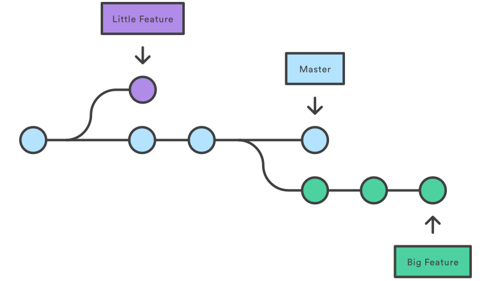

Image from https://www.atlassian.com/git/tutorials/using-branches


Developers can create a new branch for their new feature, code the feature on that branch, then merge it back into the main branch. The main branch should only have the final, production ready code. Let's create a new feature branch

```
git branch new-feature-1
```

If we want to now move into our new-feature-1 branch, we need to checkout the branch

```
git checkout new-feature-1
```

Now whilst we remain in this branch, all our future commits will be in it.

```
echo "Trying out new branch" >> README.md
git add README.md
git commit -m "Updated the README.md"

echo "CCC is awesome" >> README.md
git add README.md
git commit -m "Wrote about CCC in README.md"
```


Now checkout to the main branch. These changes won't be there.

```
git checkout main
cat README.md
```


We can merge the changes into master by running the command below

```
git merge new-feature-1
```


Now the README.md in the main branch has all the changes made from the new-feature-1 branch. 


### Merging

When working on a new feature, we may conflict with lines of code in the main branch. Let's checkout into the new-feature-1 branch. Now let's say we changed the second line from "CCC is awesome" to "CCC is really cool" and committed it. In the main branch, let's change the second line from "CCC is awesome" to "CCC is lots of fun" and commit it.  The two branches have now diverged from each other. 

Let's say we want the changes in new-feature-1 branch to be merged into the master branch. Git is going to have to create a new commit to merge together the new-feature-1 branch and the master branch. Let's checkout the master branch and merge in the feature-1 branch.

A conflict occurs between these two branches so the automatic merge failed. Git does not know whether to keep "CCC is awesome" or "CCC is lots of fun". If we open up the README.md file, we see that Git has modified it to show us the difference between the two branches. The conflict needs to be resolved by us deleting all the unnecessary modifications made by Git and also delete one of the two lines "CCC is awesome" or "CCC is lots of fun".

Now that we have resolved the conflict. We just add the file to staging and commit as normal.


**References**

https://www.howtogeek.com/180167/htg-explains-what-is-github-and-what-do-geeks-use-it-for/

https://www.atlassian.com/git/tutorials/using-branches/git-checkout

https://www.atlassian.com/git/tutorials/using-branches/merge-conflicts

https://www.perforce.com/blog/vcs/what-is-version-control

https://git-scm.com/book/en/v2/Git-Basics-Working-with-Remotes

