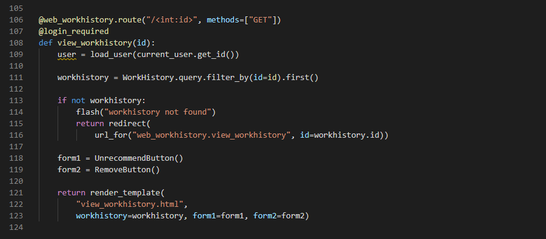

# Term 4 Workbook - T4A1 Developer Workbook


## Question 13


```python
import random

class Car:
    def __init__(self, brand):
        self.car_name = brand

    def present(self):
        return 'I have a ' + self.car_name

class Model(Car):
    def __init__(self, brand, mod):
        super().__init__(brand)
        self.model = mod

    def show(self):
        return self.present() + ', it was made in ' + str(self.model)

makes = ["Ford", "Holden", "Toyota"]
models = []
for i in range(40):
    models.append(i+1980)

def random_int_from_interval(min,max):
    return random.randint(min, max)

for model in models:
    make = makes[random_int_from_interval(0, len(makes)-1)]
    model = models[random_int_from_interval(0, len(makes)-1)]
    my_car = Model(make, model)
    print(my_car.show())
```


### Comments on what the code snippets does on each line.

<b>Lines 1 - 8</b>

```python
import random

class Car:
    def __init__(self, brand):
        self.car_name = brand
        
	def present(self):
    	return 'I have a ' + self.car_name
```


**Line 1** - The import statement tells Python to search for the module named ```random```. The `random` module uses pseudo-random number generators for its various distributions. The module is found by the interpreter and a module object  called `random` is initialised. This module contains the function `randint` which will be used later in the code snippet for randomly selecting a make and model of a car.

**References**

https://docs.python.org/3/tutorial/modules.html


**Line 3** - This line creates a new class called `Car`. This is a blueprint for a new type of object and it enables objects of that type to be created.  No instances of `Car` can be initialised before defining the `Car` class so it is unsurprising that it is at the top of the file. Furthermore, classes usually have attributes and methods to give it functionality. The lines to follow give the `Car` class its functionality.

**References**

https://docs.python.org/3/tutorial/classes.html

https://realpython.com/python-main-function/


**Lines 4 and 5** - The `Car` class has the reserved`__init__` method. The `__init__` method is known as a constructor and when a new instance of the `Car` class is created, the `__init__` method is called so that the statements within the `__init__` method are executed. The `__init__` method is used to initialise the attributes of an object. In this case, the value of one instance variable is set in the `__init__` method. The instance variable is`car_name`and its value is set for just that particular instance by using `self`. 

The first parameter of a method is named `self` by convention. `self` is used to represent that particular instance of the class. Therefore by using `self.car_name`, the instance variable `car_name` is set for just that particular instance. The new car object has it's `car_name` attribute set equal to the value of the `brand` argument.

**References**

https://www.tutorialspoint.com/What-is-difference-between-self-and-init-methods-in-python-Class

https://www.geeksforgeeks.org/self-in-python-class/

https://www.journaldev.com/18397/python-class-init

https://micropyramid.com/blog/understand-self-and-__init__-method-in-python-class/

https://www.edureka.co/blog/self-in-python/


**Lines 7 and 8** - These lines define a method called `present`. The method is available to all instances of the `Car` class and classes derived from it. When called on a particular `Car` object, it concatenates 'I am a '  and the object's car name. It can get access to the object's `car_name` attribute by using the first argument of the method which is named `self`. After the strings 'I am a ' and `self.car_name` are concatenated, the resulting string is returned. In our case, if the car name was 'Holden', it would concatenate the two strings 'I am a ' and 'Holden', before returning the one string 'I am a Holden'. 

**References**

https://docs.python.org/3/tutorial/classes.html

https://www.geeksforgeeks.org/python-string-concatenation/


<b>Lines 10 - 16</b>

```python
class Model(Car):
    def __init__(self, brand, mod):
        super().__init__(brand)
        self.model = mod

    def show(self):
        return self.present() + ', it was made in ' + str(self.model)
```


**Line 10** - The lines define another class called `Model`. The `model` class is defined to inherit from the base class called `Car` which has previously been defined. Inheritance in Python means that attributes and methods in the base class are inherited into the derived class. In this example, the base class is `Car` and the derived class is `Model`, therefore the `Car`'s attributes and methods are available to be accessed by the `Model` class. Specially, the `Car`'s attribute `car_name` and method `present` are accessible to the `Model` class.


**Line 11** - The line has the method that initialises the `Model` object. The first parameter is `self` and refers to the particular instance of the model class that is being instantiated. There are two other parameters named brand and mod. 

**Line 12** - The super() function returns a temporary, proxy superclass object. In this case, the temporary object is of type `Car` and therefore gives the `Model` class access to the `Car` methods. The init method is then called on the `Car` object. This initialises the attributes of `Car`. The value of the `brand` attribute is passed to the`Car` class and is assigned to the `car_name` attribute. Since we inherit attributes from the base class `Car`, we can then access the `car_name` attribute from the `Model` class

**References**

https://realpython.com/python-super/

https://appdividend.com/2019/01/22/python-super-function-example-super-method-tutorial/


**Line 13** - The value of the `mod` argument is assigned to the `model` attribute within the `Model` class. This is done using the first argument of the `init` method which is called `self` by convention.  The first argument `self` represents an instance of the `Model` class. It allows us to assign the value of `mod` to the `model` attribute of this particular instance.

**Lines 15 and 16** - Here we have the `show` method. Since the `Model` class inherits from the `Car` class, we can call the `Car`'s `present` method, even though we are in the `Model` class. We access the `present` method by calling it on the first argument `self`. The present method, as mentioned in the Line 7 explanation, concatenates 'I am a '  and the object's car name before returning it as one string. Furthermore, the string concatenates with '', it was made in " and the string version of the `model` attribute. After being concatenated, the new concatenated string is returned. Eg. if the car name was Ford and the model was 1980, the show method would return 'I have a Ford, it was made in 1980'.


<b>Lines 18 - 24</b>

```python
makes = ["Ford", "Holden", "Toyota"]
models = []
for i in range(40):
    models.append(i+1980)

def random_int_from_interval(min,max):
    return random.randint(min, max)
```


**Line 18** - The `makes` variable is assigned a list of strings. It holds 3 strings that can be indexed by 0, 1 and 2 respectively. Each string represents a different kind of make and will be randomly chosen later in the code snippet.

**Line 19** - An empty list is assigned to the `models` variable. In the next two lines, the list will be populated with the integers 1980, 1981, 1982, ..., 2019.

**Line 20 and 21** - The `range` object can accept a start, stop and step value. However, in this case, only the stop value of 40 is provided, therefore, the start value defaults to 0 and the step value defaults to 1 because they were not specified. The `range()`object returns an iterator of integers which will be used to generate the integers from the start value, up to but not including the stop value. The start value is 0, the stop value is 40, and the step value is 1 so each integer from 0 to 39 will be generated one at a time. 

The `for loop` iterates through each integer generated by the iterator and assigns it to the `i` variable. Each time `i` is assigned a new integer, the statement within the `for loop` is executed. The sum of `i` and 1980 is appended to the end of the models list. Once again, the value of `i` is incremented and the sum of `i` and 1980 is appended to the end of the models list. This process repeats until the value of `i` reaches 39, then for the last time, the sum of `i` and 1980 is appended to the end of the models list.

**Line 23 and 24** - The `random_int_from_interval` function takes two arguments, the min and max. Both arguments must be numbers. The function will return a random integer between those two numbers, inclusive. 

In our case `random_int_from_interval(0,2)` will return either a 0, 1 or 2. The probability of returning each integer is the same. There are 3 different integers, therefore each integer has a 1/3 or 33.3% chance of being returned. 

Likewise, `random_int_from_interval(0,39)` will return either a 0, 1, 2, 3, ..., or 39. In this case, each integer has a 1/40 or 2.5% chance of being returned.

**References**

https://docs.python.org/3/reference/compound_stmts.html

https://www.geeksforgeeks.org/python-range-does-not-return-an-iterator/

https://docs.python.org/3/library/random.html


<b>Lines 26 - 30</b>

```python
for model in models:
    make = makes[random_int_from_interval(0, len(makes)-1)]
    model = models[random_int_from_interval(0, len(makes)-1)]
    my_car = Model(make, model)
    print(my_car.show())
```


**INTENTIAL TYPO**!!!!!!! Say what will happen because of the type and then say what it should be.

**Line 26** - The `for loop` iterates through each item in the `models` list and assigns the value to the `model` variable. The `models` list is populated with integers from 1980 to 2019. Therefore, the `mode`l variable will be assigned the value of 1980 during the first iteration of the loop, 1981 for the second iteration of the loop, and so on until it is assigned the value of 2019 for the final iteration of the loop.

**Line 27** - The `len(makes)` function returns the number of items in the `makes` list. There are 3 items so it returns 3. Therefore the `make` variable is going to be randomly assigned one of the strings in the `makes` list. It will be assigned to either "Ford", "Holden" or "Toyota". 

**Line 28** - The `len(model)` function returns the number of items in the `models` list. There are 40 items so it returns 40. Therefore the `models` variable is going to be randomly assigned one of the integers in the `models` list. It will be assigned to one of the integers between 0 and 39 inclusive.

**Line 29** - The `Model` class takes two arguments in order to instantiate an object. Those two arguments are `make` and `model`. Once the `model` object is instantiated, it's reference is assigned to the `my_car` variable. 

**Line 30** - The `show()` method is called upon the `my_car` object. The functionality of the show method is covered in the explanation of lines 16 and 17. Essentially, Those two arguments are `make` and `model`. Once the `model` object is instantiated, it's reference is assigned to the `my_car` variable.


## Question 12


**JSON** stands for **JavaScript Object Notation** and represents data in an unordered collection of key-value pairs, similar to a dictionary in python.

JSON can be **manipulated** by converting a JSON string into a python object  It can be done in a python file by using the `loads` method from the `json` module. 

Other features of JSON are that it is human-readable, widely used in other languages and by default can only represent a subset of Python built-in data types. 


### json.loads()  method

Here is an example of a **JSON string** being converted into a **python object** using the `json.loads()` method

```python
import json

sporting_interests = '{"name": "Michael", "sports": ["AFL", "Soccer"]}' # JSON string
sporting_interests_dict = json.loads(person) # Convert to python object

# Output: {"name": "Michael", 'sports": ["AFL", "Soccer"]} # Python object
print(sporting_interests_dict) 

# The python object is a dictionary 
# Output: ["AFL", "Soccer"]
print(sporting_interests_dict["sports"])
```


In the code above, `sporting_interests_dict` is a python object. We can change the contents of the python object and then convert the **python object** back into a **JSON string**.

 It can be done in a python file by using the `dumps` method from the `json` module. 


### json.dumps()  method

Here is an example of a **python object** having its contents changed and then being converted into a **JSON string** using the `json.dumps()` method

```python
# continued from the previous python code

# change the contents of the python object
sporting_interests_dict["sports"] = ["Badminton", "Basketball"]

# Output: {"name": "Michael", 'sports": ["Badminton", "Basketball"]} # Python object
print(sporting_interests_dict) 

sporting_interests = json.dumps(sporting_interests_dict) # Convert to JSON string

# Output: {"name": "Michael", 'sports": ["Badminton", "Basketball"]} # JSON string
print(sporting_interests)

```


Let's convert it back again to a **python object**

```python
# continued from the previous python code

# change the JSON string to python object
sporting_interests_dict = json.loads(sporting_interests)

```


We can write the new sporting interests to a file as **JSON**. 

### json.dump()  method

Below the `json.dump()` convert the python object to a **JSON object** and then writes it to a file called `new_file.txt`

```python
# continued from the previous python code

with open('new_file.txt', 'w') as json_file:
  json.dump(sporting_interests, json_file)

```


The JSON object is now located in the file called `new_file.txt`. We can exit our python program and the JSON object will still be left in the `new_file.txt` file. 

Here is a look at our file which contains the **JSON object**

```json
{"name": "Michael", 
"languages": ["Badminton", "Basketball"]
}
```


We can create a new program and run it to retrieve our **JSON object ** from the file.


We can read it in to our python file by using the `json.load()` method.

Here is an example of reading the **JSON object** from the file

### json.load()  method

Here is an example of reading the **JSON object** from the file using the `json.load()` method.

```python
import json

with open('path_to_file/new_file.txt') as f:
  data = json.load(f)

# Output: {'name': 'Michael', 'sports': ['Badminton', 'Basketball']}
print(data)
```


### Serialising python objects into a json format


Above the **load, loads, dump and dumps** methods were used to convert from **JSON** to **Python** and **Python** to **JSON**. They all dealt with **primitive Python types that have a direct JSON equivalent**. Sadly, the JSON encoder is limited in that it can **only serialize basic data types** such as lists, strings and numbers. 

An instance of a Python Class cannot be so simply encoded into JSON. Likewise JSON cannot be so easily decoded into an instance of a Python class.


### Serialising using JSONEncoder

Instead, what can be used is a **JSONEncoder**. The **JSONEncoder** has a `default()` method which defines how the object `o` is to be serialised. Whenever we execute `JSONEncoder.encode(object)`, the `default()` method will be used on any objects which are not natively JSON serialisable.

An easy way to encode an object is as a JSON object.

For example

```python
import json
from json import JSONEncoder

class Student:
    def __init__(self, name, age, location):
        self.name = name
        self.age = age
        self.location = location
        
# JSONEncoder
class StudentEncoder(JSONEncoder):
    def default(self, o):
        dictionary = o.__dict__
        dictionary["__student__"] = True # I include this so we know that the object type is student
        return dictionary

student = Student("Michael", 25, "Melbourne")
        
print("After being encoded, it will look like this")
print(StudentEncoder().encode(employee))

print(type(studentJSONData)) # Output: <class 'str'>
print(studentJSONData) # Output: {"name": "Michael", "age": 25, "location": "Melbourne"}
```


### Deserialising

We also can go backwards by decoding the JSON object back into a python object of type Student. In order to do this, we will just get the name, age and location values from the json object, use them to create a new Student object and return it.

The decode_student function will return the new Student object using the values from the JSON object.

```python
# continue from above code

def decode_student(dct):
    if "__student__" in dct:
        return Student(dct["name"], dct["age"], dct["location"])
    return dct


student_object = json.loads(studentJSONData, object_hook=decode_student)

print("Type of student object: " + type(student_object)) # Type of student object: <class '__main__.Student'>
print("Name: " + student_object.name) # Name: Michael
print("Age: " + str(student_object.age)) # Age: 25
print("Location: " + student_object.location) # Location: Melbourne
```


In summary, the json module has methods for manipulating data and storing it in a file as a JSON data type. JSON is human-readable and has directly equivalent data types in python. The code snippets above showed how it could be used with both primitive as well as custom data types.


**References**

https://realpython.com/python-json/

https://pynative.com/python-json/

https://www.programiz.com/python-programming/json

https://pynative.com/make-python-class-json-serializable/

https://docs.python.org/3/library/json.html


## Question 11


In Python, an **Object** is an instance of a class.  Therefore, before our **custom objects can be manipulated**, the classes need to be defined. **Classes** are the blueprints that are used in order to instantiate an object. Many instances can be created from the one class. Classes often have attributes including primitive data structures such as numbers, strings and lists. Also classes often have methods which have one or more parameters. These methods give the class functionality and the ability to **change its own attributes**.


### Initially set object attributes

Initially the **object's attributes** can be **set** by passing arguments into the constructor.


In our example, the **Animal class** takes the following arguments: name, age, vertebrate,  number_of_legs, can_fly.

The **Dog class** takes the following arguments: name, age, breed

The **Parrot class** takes the following arguments: name, age, color_feather


```python
class Pet():
    
    number_of_pets = 0
	
    def __init__(self, name, age, vertebrate,  number_of_legs, can_fly):
        self._name = name
        self._age = age
        self._vertebrate = vertebrate
        self._number_of_legs = number_of_legs
        self._can_fly = can_fly
        self.number_of_pets += 1
        
    def greeting(self):
        return "I am " + self._name + " and am " + self._age + " years old."
    
    def aged_a_year(self):
        self._age += 1
    
    @property
    def vertebrate(self):
        return self._vertebrate

    @property
    def number_of_legs(self):
        return self._number_of_legs
    
    @property
    def can_fly(self, x):
        return self._can_fly

    @vertebrate.setter
    def vertebrate(self, x):
        if type(x) == bool:
            self._vertebrate = x

    @number_of_legs.setter
    def number_of_legs(self, x):
        if x >= 0:
            self._number_of_legs = x
    
    @can_fly.setter
    def can_fly(self, x):
        if type(x) == bool:
            self._can_fly = x


        

class Dog(Pet):

    number_of_dogs = 0
    
    def __init__(self, name, age, breed):
        super().__init__(name, age, True, 4, False)
        self._breed = breed
        self.number_of_dogs += 1

    @classmethod
    def count(cls):
        return "The total number of dogs is " + str(cls.number_of_dogs) + "."

    @staticmethod
    def make_noise():
        return "bark! bark!"

    @property
    def breed(self):
        return self._breed

    @breed.setter
    def breed(self, breed):
        self._breed = breed


    

class Parrot(Pet):

    number_of_parrots = 0
    
    def __init__(self, name, age, color_feather):
        super().__init__(name, age, True, 2, True)
        self._color_feather = color_feather
    
    @staticmethod
    def make_noise():
        return "Sqwark! Sqwark!"

    @classmethod
    def count(cls):
        return "The total number of parrots is " + str(cls.number_of_parrots) + "."

    @property
    def color_feather(self):
        return self._color_feather

    @color_feather.setter
    def color_feather(self, color_feather):
        if type(color_feather) == str:
            self._color_feather = color_feather
        
        
```


### Manipulate object attributes

For **manipulating the object's attributes**, I have made sure that each of the classes have been defined with **setters**. Also, to verify that an **object has been manipulated**, I have **@property** annotations above methods that return the attribute value of the object. We can see what the attribute's value has been changed too.


Let's create **two objects** and **manipulate their attributes** by using **setters**. Also note that all the code is continued from the previous code snippet.

```python
polly = Parrot("Polly", 2, "Red")

charlie = Dog("Charlie", 4, "Golden retriever")

# Output is: "Initially, the Parrot's feather color is Red"
print("Initially, the Parrot's feather color is " + polly.color_feather) 


# Change the object's color_feather attribute to Blue
polly.color_feather = 'Blue'

# Output is: "Now, the Parrot's feather color has been changed to Blue"
print("Now, the Parrot's feather color has been changed to " + polly.color_feather)


# Change the object's color_feather attribute to Green
polly.color_feather = 'Green'

# Output is: "Again, the Parrot's feather color has been changed. It is now Green"
print("Again, the Parrot's feather color has been changed. It is now " + polly.color_feather)

```


Above, we see how the `color_feather` attribute was **manipulated multiple times**. 

Also, to ensure that it would be **manipulated to a string value**, there is an if condition that the new value must pass.

`if type(color_feather) == str:`


### Manipulating variables shared by all objects

Next, notice that the class variable `number_of_parrots` is **incremented** each time a new parrot object is created.

Likewise, the class variable `number_of_dogs` is **incremented** each time a new dog object is created.

Finally, the class variable, `number_of_pets` is **incremented** when either a new dog or new parrot is created.


```python

# Output: The total number of parrots is 1
print(Parrot.count())

# Output: The total number of dogs is 1
print(Dog.count())

# Output: The total number of pets is 2
print(Pet.count())


sunny = Parrot("Sunny", 2, "Red")
tweety = Parrot("Tweety", 8, "Grey")
coco = Parrot("Coco", 5, "Orange")

oscar = Dog("Oscar", 6, "Poodle")
ollie = Dog("Ollie", 4, "Beagle")


# Output: The total number of parrots is 4
print(Parrot.count())

# Output: The total number of dogs is 3
print(Dog.count())

# Output: The total number of pets is 7
print(Pet.count())
```


**Class variables below to all objects** so by changing the class variable we are also **manipulating an attribute shared by all of the objects**.


### Delete an attribute of an object

Another way to **manipulate** **an object** is to **delete one of its attributes**


```python
print("The color of coco's feather is ")
# Output: "Orange"
print(coco._color_feather)

# Delete the _color_feather attribute from the coco object
del coco._color_feather


print("The attribute has been deleted from the coc object. Let's verify that the attribute is indeed gone.")

# Output: AttributeError: 'Parrot' object has no attribute '_color_feather'
print(coco._color_feather)
```


### Delete the object itself

We can also **manipulate** **an object** by **deleting it**


```python
# Output: <__main__.Dog object at 0x7fa10fc97070>
print(ollie)

del ollie

# Output: NameError: name 'ollie' is not defined
print(ollie)
```


**References**

https://www.programiz.com/python-programming/class


## Question 10


An **array** stores multiple items in one single variable and the items it holds can be both indexed and manipulated. In Python, **an array of items that can be manipulated is called a** **list**. 

Here is an example of a list.

```python
colors = ['red', 'yellow', 'green']
```


### Append

The list can be **manipulated** by appending a new item to the end of the list.

Let's append the color 'blue' to the end of the `colors` list.

```python
colors.append('blue')

# Output: ['red', 'yellow', 'green', 'blue']
print(colors)
```


### Pop

The list can have its **last item removed** by popping it from the list.

Let's pop the last item in the **colors** list.


```python
colors.pop() # removes 'blue'


# Output: ['red', 'yellow', 'green']
print(colors)
```


Also a specific item within the list can be removed by using the pop method and **specifying its index position**.

Let's pop the item at the 1st index position.


```python
colors.pop(1) # removes 'yellow'


# Output: ['red', 'green']
print(colors)
```


### Insert

The insert method will insert a specified value into a specified index position within the list. 

The syntax `list.insert(i, elem)` means that the element `elem` will be inserted into the `ith` position. All the elements after `elem` are moved **one position to the right**.

Note that the index positions starts at 0.

Let's insert the color `'orange'` into the `1st` position. The items `'yellow'` and `'green'` will move one position to the right.


```python
colors.insert(1, "orange") # insert the string 'orange' into the 1st position in the list.

# Output: ['red', 'orange', yellow', 'green']
print(colors)
```


### Modify

Let's modify an item in the list. Instead of 'orange', lets change the color to be 'olive'. In order to modify the item 'orange', we need to **index it and also specify its new value**.

The syntax looks like **ListName[Index of item to modify] = new value** 


```python
colors[1] = "olive" # modify the element in the 1st position of the list to be the string 'olive'.

# Output: ['red', 'olive', yellow', 'green']
print(colors)
```


### Remove

The remove method will **get rid of the first matching element** in a list. It will look through the list from **left to right** and remove the first matching element. If there is no match, the remove method will raise a **ValueError** to signify that the value is not appropriate.

The syntax `list.remove(elem)` means that the first occurrence of the element `elem` will be removed. Also note that the method does not return any value.

Let's remove the first occurrence of the color `'yellow'`.


```python
colors.remove("yellow") # remove the first occurance of the string 'yellow' from the list.

# Output: ['red', 'orange', 'green']
print(colors)
```


### Sort

The sort method will sort the elements in a list. By default, strings are sorted in alphabetical order and numbers are sorted in ascending order. Also the reverse parameter can be set to true in order to sort in descending order.


```python
colors.sort() # sort the colors in alphabetical order

# Output: ['green', 'orange', 'red']
print(colors)

colors.sort(reverse=True) # sort the colors in descending order

# Output: ['red', 'orange', 'green']
print(colors)


numbers = [3,5,1,4,2]

numbers.sort() # sort the numbers in ascending order

# Output: [1, 2, 3, 4, 5]
print(numbers)

numbers.sort(reverse=True) # sort the numbers in descending order

# Output: [5, 4, 3, 2, 1]
print(numbers)

```


We can also pass our own key function as an optional parameter. This tells the function how to sort the elements of a list.

Let's sort a list by the length of each element.


```python
words = ['bathroom', 'phone', 'wardrobe', 'watch', 'kitchen']
words.sort(key=len)

# Output: ['phone', 'watch', 'kitchen', 'bathroom', 'wardrobe']
print(words)
```


Finally, be careful to check that all the items in the list can be compared. For example, **integers and strings are not comparable** using the default sorting function.


```python
items = ['bathroom', 1, 'wardrobe', 8, 'kitchen']

# Output: TypeError: '<' not supported between instances of 'int' and 'str'
words.sort()

```


### Delete

The delete method will **remove one or more items from the list by specifying their index**. Lets delete the items that are located at either index 1 and 2. 


```python
words = ['bathroom', 'phone', 'wardrobe', 'watch', 'kitchen']
del words[1:2]

# Output: ['bathroom', 'watch', 'kitchen']
print(words)
```


### Clear

The clear method will empty the list of all its items. It is equivalent to **deleting each and every item** from the list.


```python
words = ['bathroom', 'phone', 'wardrobe', 'watch', 'kitchen']
words.clear()

# Output: []
print(words)
```


 **References**

https://www.w3schools.com/python/python_arrays.asp

https://docs.python.org/3/tutorial/datastructures.html

https://www.programiz.com/python-programming/methods/list/remove

https://www.geeksforgeeks.org/python-list-remove/

https://datatofish.com/modify-list-python/

https://www.programiz.com/python-programming/methods/list/sort


## Question 9


In python, variables can store many **different datatypes**.

The following are some of the built-in data types.


**Numeric types**:		int, float, complex

**Sequences:** 			   list, tuple, string

**Mappings:** 				dictionary

**Set types:** 			     sets


### **Numeric types** 

These are different kinds of numbers such as **int**, **float** and **complex**.


An **int** is a positive or negative whole number, including 0. Numbers of type **int** **do not have a fractional part**.

In addition, **integers can be in a different base than 10.** For example, integers can be in base 2, 8, 16 and many others. In other words, integers can be formatted as binary, octal, hexadecimal or many other values.

```python
0b1001 # binary value. This is the same as the integer 9 in base 10.

0xaf # hexidecimal value. This is the same as the integer 191 in base 10

0o32 # octal value. This is the same as the integer 26 in base 10
```


A **float** is any **real number that** **does have a fractional part**. The factional part is denoted by numbers after a decimal point or by scientific notation. For example, **1.5** has a number after the decimal point so it is a **float**. **7.8925e3** is in scientific notation but is still a **float**. 

On almost all platforms, **Python floats have** **64 bit precision**. The maximum float number is about **1.8 x 10^308**. In other words, a float can have **307 digits** **before the decimal** and there is no problem. After the maximum float number, python will indicate the float value as **inf**. 

```python
# Output: 1.79e308
print(1.79e308)


# Output: inf
print(1.8e308)
```


Floats are also very precise. In computer hardware, **floating point numbers are approximated by using a sum of base 2 fractions**.

For example, here are some examples of how decimal fractions are represented as a sum of base 2 fractions


In general though the decimal floating-point numbers **can only be approximated by** the binary floating-point numbers.

For example,


In base 2, 0.1 is the infinitely repeating fraction 0.00011001100110011001100...

**However there are only a finite number of bits that can be stored in memory**.

On most machines, **floats are approximated using the first 53 bits** starting from the most significant bit.

Therefore, the float value is only **accurate up until that 53th bit**.


For example, the true decimal value of the binary approximation stored for 0.1 is slightly off.


```python
>>> 0.1
0.10000000000000000555111512
```


To keep it manageable, Python just displays the rounded value


```python
>>> 1/10
0.1
```


**Complex numbers** have a real and an imaginary component. If a and b are real numbers and i is the square root of -1, then all imaginary numbers can be written in the form **z = a + bi**.


Let's create a complex number using the built-in `complex` class.

```python
# Initializing real numbers 
a = 7
b = -4
  
# converting a and b into complex number 
z = complex(a,b)

# Output is 7
print (z.real) 

# Output is 4
print (z.imag) 
```


**References**

https://realpython.com/python-data-types/

https://www.w3schools.com/python/python_datatypes.asp

https://www.geeksforgeeks.org/complex-numbers-in-python-set-1-introduction/


### Sequences

Lists, tuples and strings are all a kind of ordered **sequence**. A sequence is made up of elements and each one has an index value that can be used to access that particular element. The element at the first position is at index 0. the element at the second position is at index 1, and so on. Additionally, negative indexing can be used. The element in the last position is at index -1. the element in the second last position is at index -2, and so on. Below is an example of using both positive and negative indexes to access elements in a list.


**Positive indexes**


**Negative indexes**


Images are from https://railsware.com/blog/python-for-machine-learning-indexing-and-slicing-for-lists-tuples-strings-and-other-sequential-types/


 Sequences can be iterated through by an iterator. This means that they can be looped through by a **for loop**.

Here are some examples of looping through sequences and using indexes.


```python
animal_list = []
# Loop through a tuple
for word in ("horse", "parrot", "dog", "cat"):
    # Manipulate a list by appending elements to it
	animal_list.append(word)

animal_string = ""
# Loop through a list
for word in animal_list:
    # Cannot manipulate a string so a new string must be created each time
    animal_string += word + " "

# Output: "horse parrot dog cat"
print(animal_string)

# Sequences can be sliced
# Output: "parrot dog"
print(animal_string[6:16])

# Sequences can be indexed 
# Output: "parrot"
print(animal_list[-3])


    
```


Additionally, the **membership operator** can be used to test if an item is in a sequence.

`x in my_sequence` will test whether the item x is a member of my_sequence. If x is a member of my_sequence, then `x in my_sequence` will evaluate to True. Otherwise, it will evaluate to False

For example, below we test whether an item is in a sequence.

```python

# Output: True
print(1 in  [1,2,3,4,5])

# Output: False
print(-3 in  [1,2,3,4,5])

# Output: True
print('g' in 'dog')

# Output: False
print('a' in 'dog')

# Output: True
print('horse' in ('parrot', 'horse', 'dog'))

# Output: False
print('ho' in ('parrot', 'horse', 'dog'))
```


**Lists** are a **mutable** type of sequence in that the elements of a list can be changed and a list can have its **length varied** through both appending and deleting elements. Syntactically, the elements in a list are comma-separated and are between square brackets.

For example

```python
my_list = ['Python', 'Java', 'HTML']
```

Lists can have elements of different types and the elements can be **modified** and **deleted**. 

Also new elements can be **appended** to a list.

For example,

```python
my_list[2] = 'CSS' # Modifies the 'HTML' element at index 2 to be 'CSS'

# Output: ['Python', 'Java', 'CSS']
print(my_list)


del my_list[1] # Deletes the 'Java' element at index 1

# Output: ['Python', CSS']
print(my_list)

my_list.append(12345)

# Output: ['Python', CSS', 12345]
print(my_list)


```


**Tuples** are similar to lists in that they are a sequence that contains elements. These elements can be any data types and the elements can be accessed through using their index. 

However, tuples are different to lists in that they are **immutable**, **cannot be copied** and are **not enclosed by** **square brackets**.

Unlike lists, tuples are a **fixed length**. 


```python
list_elements = ['AFL', 10, 'shop']
tuple_elements = ('Dog', True, 'Book', 'Ski')

# The list can be manipulated
list_names.insert(2, "beach")
del list_names[0]


# Output: [10, 'beach', shop']
print(list_names)


# A tuple cannot be manipulated
# Output: TypeError: 'tuple' object doesn't support item deletion
del tuple_elements[1]

# Output: TypeError: 'tuple' object does not support item assignment
tuple_elements[0] = 7


```


A **string** is a sequence of characters. Unlike lists, strings are **immutable**. This means that they cannot be altered once its declared.

Strings are usually surrounded by either single quotes or double quotes.

For example,

```python
text1 = 'The man went to the shop'
text2 = "The weather was sunny"
```


However, you can also use triple singe quotes or triple double quotes. This allows you to specify multi-line strings.

Also single and double quotes can be used whenever you like within triple quotes.

```python
text3 = '''The dog went for a walk.
			He had a nice time.'''
text4 = """I enjoyed the summer.
		   I often go to the beach."""
```


Strings cannot have their sequence of characters manipulated. Here are a couple of examples.

```python
# Output: TypeError: 'str' object doesn't support item deletion
del text[1]

# Output: TypeError: 'str' object does not support item assignment
text1[3] = "A"

```


**References**

https://www.w3schools.com/python/python_lists.asp

https://docs.python.org/3/tutorial/datastructures.html

https://www.tutorialspoint.com/python/python_lists.htm

https://www.geeksforgeeks.org/python-difference-between-list-and-tuple/

https://www.geeksforgeeks.org/python-set-3-strings-lists-tuples-iterations/

https://railsware.com/blog/python-for-machine-learning-indexing-and-slicing-for-lists-tuples-strings-and-other-sequential-types/

https://www.tutorialspoint.com/python/membership_operators_example.htm


### Mappings


**Dictionaries**

A dictionary is a data type which contains unordered **key-value pairs**. Unlike the sequences that were described above, dictionaries do not use a range of numbers to index its values. Instead, the **values** in a dictionary **are indexed by keys**. In a dictionary, each key is unique and each key maps to a particular value. Syntactically, the key-value pairs in a dictionary are comma-separated. A colon separates each key and its associated value. The collection of key-value pairs are enclosed by curly braces.

For example, here are key-value pairs in a dictionary. The key represents the country and the value represents its capital city.

```python
my_dict = {'Australia': 'Canberra', 'France': 'Paris', 'Spain': 'Madrid'}
```


Additionally, **the keys in a dictionary must be hashable**. Hashable means that an object can be represented by a fixed sized integer. Hashes are used to quickly compare dictionary keys during a dictionary lookup. However, **only immutable objects are hashable**.

```python
# Strings are hashable because they are immutable

hash_value_of_Australia = hash('Australia')
hash_value_of_France = hash('France')
hash_value_of_Spain = hash('Spain')

# Output: 4156992666677561458
print(hash_value_of_Australia)

# Output: -4276661290130737973
print(hash_value_of_France)

# Output: -395462626015495190
print(hash_value_of_Spain)
```


**Strings**, as previous mentioned, are immutable so they **can be used as keys** in dictionaries. However, **lists** are mutable, so they **cannot** be keys in a dictionary.

```python
# Output: TypeError: unhashable type: 'list'
my_dict2 = {['item1', 'item2']: 4}
```


Instead, we could use a tuple, which is immutable, and therefore hashable.

```python
my_dict2 = {('item1', 'item2'): 4}

# Output: 4
print(my_dict2[('item1', 'item2')])
```


The values in a dictionary can be updated by simply assigning a new value to an existing key. Also key-value pairs can be deleted by just specifying the key of that key-value pair.

```python
my_dict3 = {'A': 'Apple', 'B': 'Banana', 'C': 'Carrot'}

# Assign a new value to the key 'A'
my_dict3['A'] = 'Almond'

# Delete the key-value pair 'B': 'Banana'
del my_dict3['B']

# {'A': 'Almond', 'C': 'Carrot'}
print(my_dict3)
```


**References**

https://realpython.com/iterate-through-dictionary-python/

https://realpython.com/python-data-types/

https://docs.python.org/3/glossary.html#term-hashable

https://docs.python.org/3/tutorial/datastructures.html

https://docs.python.org/2/faq/design.html#how-are-dictionaries-implemented


### Set types


**Sets**

A **set** is a collection of **unique elements** that are **unordered**. The elements of a set may be of different types but those types must be hashable. As previously mentioned, only immutable items are hashable. This means that **sets cannot accept data types that are mutable** like a list. Also any duplicate items in a list are automatically ignored.

```python
# Output: TypeError: unhashable type: 'list'
vowels = {'a', 'e', ['i', 'o', 'u']}


# We try to enter duplicates into a list but the set automatically ignores them
vowels = {'a', 'e', 'e','e','i','i', 'o', 'o', 'u'}

# Output: 5
print(len(vowels))

# Output: {'o', 'u', 'i', 'e', 'a'}
print(vowels)
```


Sets can contain different but immutable data types.

```python
# Contains multiple different data types
set1 = {"house", 12, True, 2.3, "cat"}

```


Sets are **unordered** so we **can't index** them

```python
# TypeError: 'set' object is not subscriptable
print(vowels[1])
```


Sets also have their own **set operations** like union, intersection, symmetric difference and difference.

Here are the symbols used in python to do these set operations:

**Union symbol:    |**				**Intersection symbol:    &** 

**Symmetric difference symbol:    ^**				**Difference symbol:    -** 


For example, we can have a set of student names who study Maths and a set of student names who study English. We can perform set operations on the two sets.

Here are some examples of using the set operations.

```python
maths_set = {'Anna', 'Brian', 'Cameron', 'David'}
english_set = {'Brian', 'David', 'Joe', 'Nick'}


# Find students who study Maths but not English. This can be found using the difference symbol: -
# Output: {'Cameron', 'Anna'}
print(maths_set - english_set)


# Find students who study both Maths and English. This can be found using the intersection symbol: &
# Output: {'David', 'Brian'}
print(maths_set & english_set)


# Find students who study Maths or English or both. This can be found using the intersection symbol: |
# Output: {'Nick', 'Anna', 'David', 'Brian', 'Joe', 'Cameron'}
print(maths_set | english_set)


# Find students who only study Maths or who only study English but do not study both. This can be found using the symmetric difference symbol: ^
# Output: {'Nick', 'Anna', 'Joe', 'Cameron'}
print(maths_set ^ english_set)


```


**References**

https://www.programiz.com/python-programming/set

https://www.w3schools.com/python/python_sets.asp

https://www.geeksforgeeks.org/python-set-operations-union-intersection-difference-symmetric-difference/

https://snakify.org/en/lessons/sets/


## Question 8


**Type coercion**  is the implicit conversion of a value from one data type to another data type. It occurs where operands of an operator are of different types and **one operand needs to be automatically converted to an “equivalent” value** of the other operand’s type. 


Python is a programming language that **does not have type coercion**. Implicit conversion from one object to another cannot occur in the Python language.

For example

```python
model = 'IPhone'
version = 3

# Output: TypeError: can only concatenate str (not "int") to str
print(model + version)
```


Instead, we need the number to be **explicitly converted** to a string before using the + operator.


```python
model = 'IPhone'
version = 3

# We need to explicitly convert the number 3 to the string '3' before using the + operator.
# The str function can be used to convert the number 3 to the string '3'

# Output: 'IPhone3'
print(model + str(version))
```


**Type coercion exists in the JavaScript language** so lets do some examples. Lets print to the console some maths operations in the JavaScript language that use a string and an integer as its operands.

```javascript
console.log('2' - 2) // Output is 0. The string '2' was coerced to the number 2.
console.log('2' * 2) // Output is 4. The string '2' was coerced to the number 2.
console.log('2' / 2); // Output is 1. The string '2' was coerced to the number 2.
console.log('2' + 2); // Output is '22'. The number 2 was coerced to the string '2'.
```


All the maths operations above **require two arguments of the same data type**, however one value is a string and the other is an integer. This is why one value must be **automatically converted** from one data type to another in order to make the maths operation work. JavaScript did this **type coercion** internally.


For example, when using the + operator with one number and one string, JavaScript internally coerces the number to become a string.

```javascript
// number,string
console.log(36 + 'dog'); // Output is '36dog'. The number 36 was coerced to the string '36'.
```


Indeed, whenever using the + operator with one string and another data type, JavaScript internally coerces the string to become an integer.

```javascript
// boolean, string
console.log(true + 'cat'); // Output is 'truecat'. The boolean value true was coerced to the string 'true'.

// string, null
console.log('Three' + null); // Output is 'Threenull'. The null value null was coerced to the string 'null'.
```


Here are a few more examples of coercion when using comparison operators.

```javascript
'4' <= 3 // Output is false. The string value '4' was coerced to the number 4

false < 5 // Output is true. The boolean value false was coerced to the number 0

null < 3 // Output is true. The null value of null was coerced to the number 0
```


**References**

https://python-reference.readthedocs.io/en/latest/docs/functions/coerce.html

http://faculty.salina.k-state.edu/tmertz/Java/041datatypesandoperators/07typecoercionandconversion.pdf

https://www.pythonmorsels.com/topics/type-coercion/#:~:text=Numeric%20Types%20and%20Coercion&text=Python%20did%20not%20coerce%20the,objects%20to%20add%20themselves%20together.

https://dev.to/ahmedtahir/what-is-type-coercion-in-javascript-4l96


## Question 7


**Control flow ** is where different blocks of code are executed based on whether a condition is true or false. 


Image is from the site https://core-electronics.com.au/tutorials/control-structure-python.html


### Sequence

**Without control flow**, a program would just be a list of statements that are **always executed in the same sequential order**, regardless of the variables values. Visually this looks like the flowchart on the left. The code blocks would predictably follow one after another without needing any decisions to be made or any conditions to be evaluated. 


### Selection

The selection control structure allows one block of code to be executed if a condition evaluates to true, and another block of code to be executed if a condition evaluates to false. In the middle flow chart, a condition is evaluated in the diamond shape and the program takes one of two actions depending on whether the condition evaluated to true or false. The middle flowchart represents a **selection control flow** and is implement in Python using the **if-else statement**. 

For example, below the question is asked whether the age is at least 18. If true, the person can enter the pub. If false, they cannot enter.

```python
age = 21
if age > 18:
	print("Welcome to the pub")
else: 
	print("Sorry, you are under the age limit")
```


The condition ` age > 18` will evaluate to either true or false depending on the value of age. If it evaluates to true then one block of code is executed, specifically line 3. Otherwise, line 5 is executed.


Moreover, there can be several conditions and several branching statements. In Python, this can be done through using a if-elif-else statement. There must be one if condition but there can be many elif conditions. The final else part is optional.

Here's an example of using multiple elif conditions. Each condition is checked one at a time from top to bottom. Once a condition evaluates to true, all the remaining conditions below it are ignored.

```python
age = 15

if age < 0 or age > 120:
	print("Please enter a valid age")
elif age < 13:
	print("You are a child")
elif age < 20:
	print("You are a teenager")
elif age < 30:
	print("You are a young adult")
elif age < 65:
	print("You are a mature adult")
else:
	print("You are a senior citizen")
    
# The output is "You are a teenager". The remaining conditions are ignored.
```


### Iteration

Another way of controlling the flow of code is by using **iteration**. An iteration structure is where a block of code is repeatedly executed as long as a condition holds true or until the end of an iterable object is reached. Once the condition becomes false or the end of the iterable object is reached, the program exits the loop and moves down to next part of code.

For example, below the question is asked of how many bottles are on the wall. If the answer is greater than 0, then the code within the while loop is executed. The condition is checked again and the code is run again. This repeats until the condition evaluates to false. This is known as a **while loop**.


```python
bottles = 100

while bottles > 0:
	print("Keep removing bottles from the wall")
	bottles -= 1
```

  

Also a **for loop** is another example of iteration. The code within the for loop will be executed again and again until the sequence is exhausted and there are no more items left that have not been iterated through.


```python
for number in [1,2,3,4,5,6,7,8,9,10]:
    print(number)
```

 


**References**

https://jakevdp.github.io/WhirlwindTourOfPython/07-control-flow-statements.html

https://core-electronics.com.au/tutorials/control-structure-python.html

http://anh.cs.luc.edu/handsonPythonTutorial/loops.html


## Question 1


Below I provide an extensive **overview of the** **source control process** I follow when coding new projects. 

### Problems that source control addresses

Before I begin, the problem that source control addresses should be explained. In a development team, multiple developers are working on the one project. They often want to make frequent changes to the project's code and want to repeatedly update the project with the new code they have written. Soon, many revisions of the code are made and some developers may try to change the same lines of code in a file but in different ways. This will lead to a conflict which must be resolved. Also it is hard to keep track of what the most up-to-date version of the project is since many developers are working on it at the same time. Many changes to the code are made by different developers and it soon can become very complex. Additionally, a developer may want to revert back to a previous version of the project or see what changes another developer made to his code. This can quickly become very disorganised and hard to track.

A source control system is needed. The **system keep tracks of all the changes being made to the project** over the development process. Also, the tasks that each developer does can be separated through them having their own **branches to work on**. The management system allows each developer to isolate their work from other developers by working on their own branch. The **source of truth for the project is kept on the main branch**. Also to be able to effectively collaborate on the project, a remote repository can be hosted on the internet so that all developers can see the project latest updates. Once a developer's new code is ready to be saved to the main branch, they can commit and merge their code onto the main branch and push it to the remote repository. This way, all the other developers can see their latest code.

**Conflicts** can occur when merging code from a developer's own branch on to the main branch. For example, a conflict arises because a file was deleted on the main branch but was edited on a developer's branch and now that developer now wants to merge his/her work onto the main branch. Another conflict example could be that one developer made an edit to a line in a file and merged it on the main branch and now another developer wants to merge a different edit to the same line in the same file. In both cases, there is a conflict that must be resolved. 


### Create Git repository

Before I start going through conflict resolution, I will go through creating a new project using a popular source control version called **Git**. The files for a particular project should all be stored in the same location. This is what a **repository** will allow us to do. Git repositories can be stored on **many websites that provide the git version control software**, these include GitLab, Beanstalk, PerForce and others. I will use the popular site called **GitHub**. This is where I will store the repository for my new project so that other developers can access it. The repository will **manage and store all the revisions of the project**. 


 I first wish to go through how I **set up my repository** for my project.

As mentioned, I use **GitHub** so the code below is specific to setting up a repository in GitHub. I create a new repository for my new project by logging into my GitHub account and clicking the plus button on the top right hand side of the page.


The drop down menu has the option *New repository*. Click that option. In the *Create a new repository* page, give the repository a name. In this example below, I enter the name *my_new_repo*. After having entered a name for the new repository, click the green button *create repository* which is located near the bottom of the page .


Once you have clicked the button *Create repository* you will be redirected to a page with instructions on how to push your new repo to GitHub. We do not yet have a local repository so we must follow the first section of instructions. The first set of instructions look like this.


Each of these commands must be run in a terminal application. Below is an image of the commands each run in my wsl terminal application. 


```bash
echo "# my_new_repo" >> README.md
git init
git add README.md
```

**Lines 1-3**

Firstly, the string "# my_new_repo" is appended to a new markdown file named README.md 

A new, empty repository is created using the git init command.

The git repository has been created, so we can now add the file named README.md to the repository's staging area. By running git add on README.md, the repository now tracks the file and prepares it to be committed. 


```bash
git commit -m "first commit"
git branch -M main
git remote add origin https://github.com/mrixon95/my_new_repo.git
git push -u origin main
```

**Lines 4-7**

The new file in now saved into the repository by using the commit command. A brief description of this save is also made and is "first commit". The saved changes also get a unique ID so that we can keep track of changes.

A new branch is created and named main. This represents the primary version of a source code repository. Its the source of truth for the project. 

In the next line, a version of the project is saved on GitHub in our my_new_repo repository and a connection between our local repository and the repository on GitHub is made. The repository on GitHub is called a remote and it is named origin.

Finally, the changes made in our local repository get pushed to the remote repository on GitHub so that those with access to our repository can see our changes. This means that the README.md file can be viewed in our GitHub repository.


### Commit changes

After we have made some significant changes to a file in our directory, we should commit those changes to our local repository. By committing those changes, we are capturing a snapshot of our project. A snapshot is a saved version of our project that is stored in the git repository. If we don't like the future code we write, we can choose to reset back to this saved version. 

Before we commit, we need to specify which edited files and new files need to be saved into this version. This is done using the git add command and serves to stage our files, ready to be committed.

Let's say we made changes to the README.md file and also created a docs directory.

We should then run the following command

``` 
git add README.md docs/
```

Now commit the edited README.md and the new docs directory to the repository. Be sure to have a short description of what is changes are being committed.

```
git commit -m "Edited README file and created docs/ directory"
```

If we run the command below, we should see details about the new commit that was made, as well as the previous commit.

``` 
git log
```

Finally, run the command below to upload the new contents of the local repository to the remote repository in GitHub. Make sure to enter your GitHub login and password when prompted.

``` 
git push
```

Now if you go to your GitHub repository, you should see the new changes in the README.md file and a new directory named docs.


### Branching

When working on a new feature, developers usually want an independent line of development to build their new feature in. This is what a branch represents. Its like a brand new working directory and project history. Here's a visual.


Image from https://www.atlassian.com/git/tutorials/using-branches


Developers can create a new branch for their new feature, code the feature on that branch, then merge it back into the main branch. The main branch should only have the final, production ready code. Let's create a new feature branch

```
git branch new-feature-1
```

If we want to now move into our new-feature-1 branch, we need to checkout the branch

```
git checkout new-feature-1
```

Now whilst we are in the new-feature-1 branch, all our new commits will be in it.

```
echo "Trying out new branch" >> README.md
git add README.md
git commit -m "Updated the README.md"

echo "CCC is awesome" >> README.md
git add README.md
git commit -m "Wrote about CCC in README.md"
```


Now checkout to the main branch and read the contents of the README.md file. The changes just made won't be there.

```
git checkout main
cat README.md
```


In order to copy over the changes from the new-feature-1 branch into the main branch We can merge the changes into master by running the command below

```
git merge new-feature-1
```


Now the README.md in the main branch has all the changes made from the new-feature-1 branch. 

Verify that the README.md file has now been updated by reading it again.

```
cat README.md
```


### Merging

When working on a new feature, we may conflict with lines of code in the main branch. Let's checkout into the new-feature-1 branch. 

```
git checkout new-feature-1 
```

Now let's say we changed the second line of *README.md* from "CCC is awesome" to "CCC is really cool" and committed it. 

*README.md* file in new-feature-1

```
Trying out new branch
CCC is really cool
```

Commit the changes

```
git add README.md
git commit -m "Changed README.me"
```


In the main branch, let's change the second line from "CCC is awesome" to "CCC is lots of fun" and commit it.  

```
git checkout main
```

README.md file in main

```Trying out new branch
Trying out new branch
CCC is lots of fun
```

Commit the changes

```
git add README.md
git commit -m "Changed README.me"
```


The two branches have now diverged from each other. 

Let's say we want the changes in new-feature-1 branch to be merged into the master branch. Git is going to have to create a new commit to merge together the new-feature-1 branch and the master branch. Let's merge in the feature-1 branch.

``` 
git merge new-feature-1
```


A conflict occurs between these two branches so the automatic merge failed. Git does not know whether to keep "CCC is awesome" or "CCC is lots of fun". If we open up the README.md file, we see that Git has modified it to show us the difference between the two branches. 

```
Trying out new branch
<<<<<<< HEAD
CCC is lots of fun
=======
CCC is really cool
>>>>>>> new-feature-1
```

In the branch we are in is called the HEAD. We have "CCC is lots of fun" in our current branch but the new-feature-1 branch has "CCC is really cool". We have a conflict that must be resolved.

The conflict needs to be resolved by us deleting all the unnecessary modifications made by Git and also delete one of the two lines "CCC is awesome" or "CCC is lots of fun".

Let's change the README.md file to read

```
Trying out new branch
CCC is really cool
```


Now that we have resolved the conflict. We just add the file to staging and commit as normal.

```
git add README.md
git commit -m "Resolved the conflict"
```

Also let's push our new code to GitHub so others can see our work. Fill in your username and password when prompted.

```
git push
```


**References**

https://www.howtogeek.com/180167/htg-explains-what-is-github-and-what-do-geeks-use-it-for/

https://www.atlassian.com/git/tutorials/using-branches/git-checkout

https://www.atlassian.com/git/tutorials/using-branches/merge-conflicts

https://www.perforce.com/blog/vcs/what-is-version-control

https://git-scm.com/book/en/v2/Git-Basics-Working-with-Remotes


## Question 2


Below I list and discuss the characterististics of quality software.

1. **Secure**

Almost all modern software stores sensitive data about users in a database. The private, valuable data that a user can give to software includes their banking details, credit card number and PIN, their password, their home address, biometric information, location data and health records. This data is private and valuable to the individual so having software that is venerable to malicious hackers is very dangerous. The secure software should protect this sensitive user data from disclosure as well as unauthorised alteration or destruction. Security matters because hacked software is damaging to the app's reputation and the owners of the app, or individuals who use it may be held to ransom by malicious attackers. The data may constitute intellectual property of the company and therefore be valuable to steal and sell to a competitor. The organisation may be apart of the government and hold confidential intelligence or military secrets. There are many different kind of data that are sensitive and the motives of the hackers could be competitive, criminal or maybe even terrorist in nature.

It is crucial that developers mitigate the risk of a cyber attack on the software. The software should be as free as possible from vulnerabilities and defects. The software should be attack resistant to the highest extent possible. This means that software should able to continue operating correctly even while attackers try to exploit weaknesses in the software. Any damage from attack-triggered faults should be limited as much as possible so that the effects of the attack are not wide-spread and recovering from it is quick. 


2. **Scalable**

Software should be able to increase its capacity and functionality as the workloads varies. Workload could refer to number of users, the storage capacity, the number of requests or anything else that pushes a system beyond its initial capacity. A high number of users making requests may slow down the server hosted the application as it may not have enough computing resources to handle it. Another problem could be that maximum storage in the application's database is reached and there is no more room to store new requests. The code itself could also be the problem if the number of operations an algorithm performs grows exponentially as the input size increase. 

The software should maintain effective performance both during and after a significant increase in workload. A company should only be using the resources they need.

**Ways to scale:**

**Vertical scaling** or scaling up refers to increasing the storage size and computing power of a computer. This would include the amount of CPU and the GB. Here's a visual using an AWS EC2 instance. The size and the computing power of an EC2 instance is increased without increasing the number of EC2 instances. 


Image from https://medium.com/@khushalbisht/aws-scaling-horizontally-vs-vertically-3e30e3e71118


**Horizontal scaling** is whereby the capacity is increased by adding on more computers to the system. In this case, we would be adding more EC2 instances to the existing pool. A load balancer can be used to route the traffic relatively evenly between the multiple instances. Here is a visual below where the number of EC2 instances has been increased from one to three.


Image from https://medium.com/@khushalbisht/aws-scaling-horizontally-vs-vertically-3e30e3e71118


It is important that when the user demand decreases again, the **system scales down** since it costs more money to run more instances or instances with higher processing power and storage. This scaling can be done automatically in AWS using the **AWS Auto Scaling feature**. It allows user to write scaling policies over multiple instances so that the process of scaling up and down is done automatically according to those policies. For example, we could target the Application Load Balancer Request Count Per Target so that it is programmed to always keep the value around 200. Instances would automatically be added and removed so that this value remains approximately the same. This is horizontal scaling.

**Horizontally scaling is generally easier than vertical scaling**. Adding more machines to an existing pool is relatively easy. However adding more capacity to an instance  does have some issues. 

Firstly, there must be some downtime for upgrading the ec2 instance size

Secondly, the upgraded machine is the single point of failure. There is no redundancy incase it fails.


**References**

https://www.softwaresuggest.com/blog/five-characteristics-make-excellent-software/

https://www.perforce.com/blog/sca/what-code-quality-and-how-improve-code-quality

https://rvtechnologies.com/8-must-characteristics-for-software-code/

https://www.geeksforgeeks.org/software-engineering-characteristics-of-good-software/

https://www.guru99.com/what-is-software-engineering.html

https://medium.com/@khushalbisht/aws-scaling-horizontally-vs-vertically-3e30e3e71118


3. **Maintainable**

Software should have an **automated test suite** so that bugs will be easy to locate and won't get pushed to production code. This is crucial since many developers could be working on the same file and new bugs can arise. Also **proper documentation** is important to maintaining code and the code should be **refactored with readability** in mind. Often when code is written the first time, it is messy. It often has either unclear variable names, repeated code, lack of spacing or other stylistic inconsistencies that reduce readability. Difficult to read code makes it very difficult for other developers to update and maintain the code.

For ensuring **readability**, make sure to **use a coding standard** for naming conventions and formatting. PEP8 provides the coding conventions for the Python language. The Flake8 package can be used to ensure that code is altered to remove stylistic inconsistencies and to conform to the PEP8 standard. Comments can be used to describe the intent and logic of code so that the reader does not need to think to hard about it themselves. This will help other developers maintain the code since it will be easier understand what the software does and therefore easier to find what needs to be updated and changed. 

Additionally, **version control software** is important for maintaining code. It ensures that the code, tests and documentation are up to date and **do not conflict** with each other. The logs and commit descriptions makes it **easier to understand what changes have been most recently made** to the code and what the intent of those changes were.

Another characteristic of maintainable software is **modularity**. This is where code is separated out into independent modules in which the internal details are hidden behind a public interface. The inner workings of a module that are not relevant to the user of the module should be hidden. The modules should be decoupled as much as possible so that the functionalities of each module are independent from each other. they do not depend on each other. This decoupling ensures that changes in one module do not cause unintended bugs in another and therefore makes code easier to maintain.

**References**

https://www.sitepoint.com/10-tips-for-better-coding/

https://www.software.ac.uk/resources/guides/developing-maintainable-software

http://singlepageappbook.com/maintainability1.html


4. **Usability**

This is an attribute of software that assesses how easy it is to use. It is important that the end user of the software is able to easily interact with it. If the software interface is difficult to get used too, buggy, not aesthetically pleasing to look at or makes it hard to complete basic tasks then this reduces the quality of the software. 

Usability is necessary for creating good software because if an application is difficult to use then most people will stop using it. If it hard to locate important information on a website then users will just go elsewhere. Few users will bother to read an application's manual or contact support since there are many other applications available to them to use. Also it the layout and graphics of an app look disorganised and unpleasant than this can affect a user's experience with the software. 

In order to identify usability problems in software, having 5 users test it out is usually enough. Additionally, frequently redesigning user interfaces based off user testing can significantly improve usability design. This iterative process means that bad features of an application are identified early in the process and can be easily fixed. This is much more preferable than finding out a feature has problems moments before release, especially if other features depend on it.

Overall, usable software should contain these 5 elements:

1. Effectiveness - It supports users ability to complete tasks that they want to complete.

2. Efficiency - The tasks can be performed relatively quickly through the easiest process possible.
3. Engagement - The graphics and features and pleasing to look at and keeps the user interested.
4. Error tolerance - Many different user actions should be anticipated, including when they make wrong actions and enter invalid data. The software should alert them to what error they have made or recover quickly from that error. Bad user input should not cause the software code to break.
5. Easy to learn - Most software should not require reading a user manual before using. Instead, the design should be intuitive and logical to use. They shouldn't have to dedicate much time to learn how to use the app.


**References**

https://www.nngroup.com/articles/iterative-design/

https://www.nngroup.com/articles/usability-101-introduction-to-usability/#:~:text=Usability%20is%20a%20quality%20attribute,use%20during%20the%20design%20process

https://www.interaction-design.org/literature/topics/usability


5. **Reliability**

This refers to the probability of the software running without failures for a specific time. Software is considered reliable if we get the same result every time and we can depend on it doing so. For modern software products, causes of failure can be categorised as unplanned events, planned events and configuration failures. For instance, **unplanned events** can include the system crashing, a response taking too much time to complete or a freeze where the computer becomes unresponsive and no longer takes any input. All of these events reduce the reliability of the software. However there are also **planned events** that affect reliability. New software updates can require a system restart, meaning that the system must go down in order to perform updates. Also new configuration changes can require shutting down the system. If these planned events happen often then the software is very unreliable. Finally, **configuration failures** can occur which include human error. 

Many tests can be performed to assess the reliability of software. Let's go through some examples. **Failure/Recovery tests** are where failures are deliberately simulated in the software. The test assess the ability of the software to detect the condition and then reconfigure the system to remain operation. Another test is the reliability life test. This is where **time to failure** of non-repairable systems and the **time between failures** needed to repair and restore the systems are tested. One another is the accelerated life test. This is where the electronic parts that run the software are subject to high temperature to see whether this affects how well the software operates.


**References**

https://www.sebokwiki.org/wiki/Reliability,_Availability,_and_Maintainability

https://www.ques10.com/p/21811/explain-software-reliability/

https://www.microsoft.com/en-us/research/wp-content/uploads/2016/02/tr-2004-145.pdf


6. **Performance**

Users of web and mobile apps demand high performance and can be quickly frustrated when software lags. It contributes to how satisfied a user is with the software and if the performance is slow then users may just quit using the software. Performance is therefore crucial and testing can be done to measure how well the software performs under varied load.

**Load testing** is used to measure the performance of the software as the **workload increases**. This workload could be an increase in users making concurrent transactions. More computing power, memory and storage will likely be needed as a result of the increase in requests to the software. The software is monitored to measure its response time as the workload increases.

Another test for performance is **stress testing**. This is where the software is deliberately given **more users or transactions than it can handle**. Here the stability of the software is tested and the **point at which the software fails is recorded**.

 One other test is **scalability testing**. With cloud computing services, applications can scale vertically and horizontally as more or less workload needs to be handled. By scaling up and down, the amount of **resources such as CPUs and memory are changed** whilst the system is still running. The effectiveness of this scaling can be tested. Specifically we can access how well the system performs in responding to user requests whilst the scaling is going on.


**References**

https://www.softwaretestinghelp.com/reliability-testing/

https://www.sebokwiki.org/wiki/Reliability,_Availability,_and_Maintainability


## Question 3


At a **high level**, my Flask app follows the **MVC pattern**. It is made up of multiple routes, controllers, models and view. The visual below gives a **high level** representation of the layout of this design pattern. 


Image is from https://realpython.com/the-model-view-controller-mvc-paradigm-summarized-with-legos/


Firstly, a user must **make a request** in their browser to the IP address and an endpoints of the Flask app. For example, In order to do so, the **URL of their request** must match one of the routes available. There are many different routes and controllers. Similar routes are grouped together in the same controller. For example, routes that create, read, update or delete work histories are all located in the *Work history* controller.  

Below, I have snippets of code. Each is an example of a different route available in the *work history* controller. This controller allows for **manipulating work histories in my database**. Here, each of the routes allow for **creating, reading, updating and deleting records** in the database that related to work histories.


**From the controller**, we can use **models to retrieve data from the database**. We do not want the controllers to directly access the database. Therefore, the models are needed to abstract the connection between the controllers and the database. This way, **we never directly interact with the database** and can perform validation checks on the data using the model.

When queries are performed on the database, the database sends back data to the controller. The controller then passes that data through to a view which renders the data on the request page.

For example, here I am in my *Account Info* page.


When I click the *Work Experience* tab in the navigation bar, a request is sent to the *work history* controller. The work history controller has a *view_workhistory* function which interacts with the *work history* model. It retrieves all the work history data from the database which was made by this user. The *view_workhistory* function within the work history controller passes the data through to a view. The view is named *view_workhistory.html* and it renders the work history page with the user's work history data. The view is a HTML page and the data is dynamically inserted into it using the *jinja2* package.

Here is the controller's *view_workhistory* function that interacted with the model and then the view.

 


Here is the view where the work history data is displayed.


One other **high level** aspect of the app is the **cloud architecture** which stores the data. As can be seen below, the EC2 instances which contain the flask application and its database were both located in the same public subnet.


The internet gateway allows **incoming traffic** from IP addresses outside the EC2 instances. It also allows **outgoing traffic** from the EC2 instances. This is useful for my Flask app because I can then make updates to my PostgreSQL database by sending a request from my EC2 instance, to the internet.


## Question 4

For a team of developers to create a quality website, they need strong web development skills. 


### HTML and CSS

Firstly, they need the technical knowledge to code in HTML and CSS. **HTML** allows developers to structure paragraphs, headings, links, images, videos and other elements within a webpage. HTML uses tags that structures the content into headers, paragraphs and other sections. Every HTML document has three block level tags, a <HTML></HTML> tag to enclose every HTML page, a <head></head> tag to hold meta information about the page, and a <body></body> tag to enclose all the content that appears on the page. A developer with good knowledge of HTML will need to be able to structure the webpage with an appropriate hierarchy of HTML tags.


**CSS** is needed as another technical skill that the developers need. Its required because it is used to describe the formatting and layout of the HTML tags on the screen. Moreover, CSS describes the styles used on the webpage such as colors and fonts used in the navigation bar, forms, tables, buttons and many more graphics. The developers can decorate their website to make it aesthetically pleasing through using CSS. All the css styling is normally saved in its own .css file. The link to the style sheet is specified in the HTML page within the <head></head> tag so that the HTML page knows what styling will be used on its tags.


### **JavaScript** 

If we want to make the site interactive, the developers need to know **JavaScript** as well. JavaScript is now used by about 92% of websites and can be added directly to the HTML or stored in .js files. JavaScript can be used to provide animated graphics and multimedia. As well, through using the DOM (Document Object Model) API, you can manipulate the HTML and CSS so that new styles, layouts and pop up windows can appear on the webpage as the user interacts with the website. JavaScript can also be used for interacting with other APIs such as the Geolocation API for geographical information eg. Google Maps, or Audio and Video APIs like HTMLMedia Element so that you can play audio and video in a webpage.


### Interacting with a Database

The website will presumably be getting data from their customers visiting their website such as their name, address and credit card details for the business orders. There would probably be a lot of customer data that the small business would want to capture. Also the content of the small business may change every so often so having a database can ease administration. For example, the small business may changes its products every season and needs to store the images, descriptions, prices, stock number, customer reviews and other information about the product. Therefore, the website will need server-side software that pulls information from a data which stores that information. Hence, the developers need to have that **server-side software knowledge** for retrieving and updating data from a database. Also **knowledge about database administration** eg. CRUD operations, deposing tables and creating relationships between tables would also be crucial.


### Domain name

Next, the small business would want its website to be made available to the public. There needs to be a name that internet users can use to find the website. Therefore, the developers need to know how to **secure a domain name** for the website. The domain name will represent the IP address of the computer where the website will be stored. In order to buy a domain name, a developer must know how to purchase a domain name from a domain name registrar such as Domain.com, GoDaddy or HostGator. Without domain names, customers would have to remember and enter a long string of numbers called an IP address in order to visit the website. This would be inconvenient and difficult to remember. Therefore associating a memorable domain name for the IP address is important. The name must not already be registered by someone else and must have a valid suffix. The name should probably be the same as the small business' name or very similar incase there already exists a website with their business' name. The suffix is usually .com. It usually takes no more than 48 hours for the new name to be set up and running on the web.

Also it is important that the developers either know the domain name's expiration date or set up an automatic renewal feature with the domain registrar. If they forget to renew the domain then it will expire and someone else may register it.


### Hosting

Next, the developer need to know how to **host the website**. Hosting a website means that the website files such as the HTML and CSS files are put on a special computer called a server. The server allows the website files to be publicly available for anyone on the internet to access. It has software installed called a web server which allows the special computer to receive incoming requests and respond to them. Usually the response contains the requested web page that the user was after. 

All websites use third-party services providers to host their websites. These third party service provides include Amazon, Google, Microsoft and others. They offer ready-to-use web servers for hosting the website. The developers should know that there are different kinds of hosting offerings depending on the specific website needs. For a small business, a shared hosting website is suitable. It costs around $2.75 to $8 a month and keeps the cost low by allowing multiple other websites to share the same server resources. If the small business has a busy time of year where they receive many more sales then they can consider upgrading to VPS hosting. It offers a flexible set of resources that can handle large spikes in traffic.


**References**

https://www.w3schools.com/css/css_intro.asp

https://au.pcmag.com/web-hosting/45573/how-to-register-a-domain-name-for-your-website

https://www.wpbeginner.com/beginners-guide/how-to-host-a-website/

https://www.wpbeginner.com/wp-tutorials/how-to-make-a-small-business-website-step-by-step/

https://developer.mozilla.org/en-US/docs/Learn/JavaScript/First_steps/What_is_JavaScript

https://www.approvedindex.co.uk/database-developers/databases-for-websites#:~:text=If%20your%20site%20content%20changes,a%20database%20can%20ease%20administration.&text=In%20this%20case%2C%20a%20database,with%20content%20from%20the%20database.


## Question 5


A recent project that I worked on was my **Flask app API**.

The **first** skill I needed was knowing how to **set up a minimal Flask application** to get me started. A minimal flask app has an instance of a Flask class in a file and at least one route.

For example

```python
from flask import Flask
app = Flask(__name__)

@app.route('/')
def hello_world():
    return 'Hello, World!'
```

I also needed to have Flask installed on my local machine so I ran 

```python
pip3 install flask
```

 Furthermore, to run the flask application, I needed to first let the terminal know which application to work with by exporting the FLASK_APP environment variable and assigned it the name of my file.

```
$ export FLASK_APP=main.py
$ flask run
 * Running on http://127.0.0.1:5000/
```


**Secondly**, I needed to know how to **write HTML templates with jinja2 placeholders** and **understand how the jinja2 syntax works**. Jinja2 placeholders can be replaced with actual values when a HTML template is rendered. It means that python objects can be passed in as arguments when the template is rendered so that the contents of the python object are displayed in the HTML file.

HTML files need to be saved in a directory called templates for the problem to work.

Here's an example

In *app/templates/index.html* we have this file below

```html
<html>
    <head>
        
        <title>{{ title }} - Blog Page</title>
        
        <title>Welcome to your Blog Page</title>
        
    </head>
    <body>
        <h1>Hi, {{ user.username }}! Here are your blog posts</h1>
        
        <div><p>On the {{post.date}}, you wrote about {{post.subject }}.
        Here is what you said: <b>{{ post.contents }}</b></p></div>
        
    </body>
</html>
```


We can then export our routes to a new page and called it *routes.py*. It would look like this.

```python
from flask import render_template
from main import app

@app.route('/')
@app.route('/index')
def index():
    user = {'username': 'Michael'}
    posts = [
        {
            'date': '01/11/2020',
            'subject': 'Day at beach',
            'contents': 'I had a very nice, sunny day at St.Kila beach!'
        },
        {
            'date': '24/11/2020',
            'subject': 'Date at the cinema',
            'contents': 'We watched the latest Avengers movie. It was awesome!'
        }
    ]
    return render_template('index.html', title='Home', user=user, posts=posts)
```


The *main.py* file would just look like this.

```python
from flask import Flask
app = Flask(__name__)
```


The **third** piece of knowledge was understanding what an **Object Relational Mapper** is and how it could be used to interact with a database using Python objects, classes and methods. An ORM is used for converting data between incompatible data types. In this case, we have Python data types such as int, float, string and boolean. These data types need to somehow be translated into storing data as fields in the database tables. The ORM will make the most appropriate data type conversion between Python and the database.

The most popular Python ORM is SQLAlchemy and that is what I learned to use in my Flask App.


The **fourth** important area of knowledge was knowing what **Database Migrations** are and how I could use them effectively in my Flask app. **Basically, they save all revisions of the database table definitions and provide methods for upgrading or downgrading a database to a new or back to an older revision.** This is crucial to be able to understand and implement since changes to a database are risky in that there may be a loss of valuable data if a mistake is made. Database migrations automatically figure out which commands need to be ran in order to update the schema of the database without losing any of the valuable data.

For example, say we have already written a database full of tables and important custom data has since been inserted into the tables by customers. We now want the database to capture credit card information. This would involve a new table in the database for the credit card details as well as a new relationship between the credit card details table and the user table. Instead of being risky and trying to manually redefine the tables in the database, it would be much safer to create a new database migration file and run it. The flask-migration package will automatically generate the code needed to adjust the tables so that the new table and relationship are added whilst no customer data is lost. Also, if we wish to undo the changes, the flask migration package has automatically written the code needed to do that. All we would need to do is run the downgrade function.


The **fifth** important skill was learning how to **deploying the Flask app to the cloud**, along with the database with which it interacts. For my app, I spun up two EC2 instances: one for the Flask application itself and another for the database. The reason that there is one for the Flask app and another for the database is that we can allow all in bound traffic to the flask app but only allow requests directly from the flask app to interact with the database. This is a security measure to ensure that anyone who wishes to interact with the database must do so through making requests to the flask app. The flask app has its own data validation for each endpoints and also restricts what requests can be sent to the database. Therefore, we are providing a layer of security so that users can't interact with our database without having their request and its contents validated. 


The **sixth** piece of knowledge required was knowing how to perform **load testing**. Each request to the API takes up some amount of CPU and RAM so as the number of users and requests increase, the required resources of the EC2 instances will increase. At some point, the performance will deteriorate as the workload becomes too much for the EC2 instances to handle.. In order to test what happens when we have thousands of users interacting with our Flask app, we can perform a load test. 

The python installation package has a useful module for load testing called **Locust**. We can use it to write user test scenarios using the Python language and see how our Flask app performs through a web interface. Below we can see how the response times change over time and begin to dramatically increase as thousands of more users interact with the Flask app.


The **seventh** skill was **Project Management**. As opposed to the previous piece of knowledge and skill mentioned, this one was more of a soft skill. Throughout the duration of the project, I thought it was important to track the tasks that I had not yet started, the tasks in progress and finally the tasks that were completed. Additionally, at times, I got stuck and was unsure how to solve a particular problem. Therefore, I wrote down multiple questions that I wanted to ask one of the CCC instructors. Finally, I had a list of all the questions that I did get an answer too. Here is a screenshot of my project management board in Trello.


The **challenges** I encountered included how do I implement a many-to-many relationship in *Flask* and how do I join together two tables in a query. Despite looking up answers on *stack overflow* and looking through tutorials online, I still had problems overcoming these challenges. Therefore, I decided to ask my CCC instructors for their thoughts on how I may do it. 

For the most part, I was able to **overcome challenges in the project through doing my own research**. I used many resources online, these included looking up Flask tutorials, finding similar questions that had been answered in *stack overflow*, watching video tutorials on *YouTube*, reading through the official flask documentation and finally reviewing lesson notes from the CCC course within *ed*. 


## Question 6


Overall, I believe that **my knowledge and skills were reasonably effective** in the Flask app project, however there **were areas of improvement**.


### Validation

In my Flask app, I was successfully able to perform **validation** on each of the values in the request's json before creating a new model object. I was able to create classes for each of the tables in my database and was able to perform checks to validate my data before inserting new records into the database. Below is an example of me trying to validating each of the values before creating a new message object, giving values to each attribute and saving it to the database. In the example below, I was able to check that both the sender and receiver of the message **did exist** and also that there was **non-empty content**. In line 48, I check that there is indeed a valid sender and receiver of the message. Furthermore in line 51, I check that the content of the message is non-empty.


In order to **improve my validation** in a future Flask app, I believe that I should have used **more Marshmallow validation**. The validation that I implemented in my Flask app functions was **repetitive**. It was repetitive because I checked the validity of the sender and receiver in multiple different functions. I could have been done more effectively by using the **schema to check that the usernames were valid.**

It would have been neater and less repetitive to have done validation through just using the schema. As can be seen below, the Message schema **did not** have its own validation for checking the existence of the sender and receiver.


Instead, a validation check could have been implemented for both the sender and receiver to ensure that they exist. The below error handler could then have been used return to the user the error messages that explain why the input was invalid.

```python
@app.errorhandler(ValidationError)
def handle_bad_request(error):
    return (jsonify(error.messages), 400)
```


### Authentication and Authorisation

I believe that my knowledge of **authenticating users** **and authorising them to do certain actions** **was reasonably effective**. I was able to write endpoints that required the user to provide their **jwt token** in the header of the request. My Flask App would **authenticate** who they were before **authorising** them to change personal content to a user such as their work history or messages with other users. Here is an example below of the user being authenticated. Once they are checked to be a valid user, they are able to create a work history object using the body of their request.


However, I believe that my Flask app was **incomplete in regards to authentication and authorisation** because there was **no admin login available**.  

For example, in my message controller I initially had an endpoint to retrieve all messages. However, many of those messages would be **personal** and therefore I believe that it **should only be accessible by an admin account**. I ended up not having enough time left to add in this feature. Here is an example below where I commented out a route endpoint because it would have allowed anyone to retrieve all the personal messages that users had sent. I considered this to be a security risk, hence why it is commented out.


If I do another Flask app project in the future, I would **create admin accounts along with normal user accounts**. These **admin accounts would have full access** to all the data in the database and would be able to **retrieve all the messages**. Also, I would give admin accounts the ability to **download all of the data** from the database and have the **data neatly saved into csv files** where each csv file contains data from a different table from the database.


### Project Management

Although I did do some project management whilst progressing during my Flask app, I think that there was **a lot of room for improvement**.

As part of managing my tasks for the Flask App, I created a **trello board**. Here is a snapshot of it.


I had a list for each of the follow: tasks to do, work in progress, completed tasks, questions to ask the CCC and the ones that had been answered. I found it useful as I could track how much progress I had made on each tasks within the project. Also I could see which questions I had not yet had answered.


Looking back, I think that my trello board was **insufficient** since my final project missed some marks on one section of the rubric. Specifically, I lost 3 marks because I failed to implement a script to **export all the data from the database**. I believe that it was completely my fault for **not reading this rubric section properly**. I only had a few endpoints that returned some data. They only returned data from one table each and would be in a JSON object. This was **very much insufficient in addressing what the rubric asked for**.

In order to **satisfy all the requirements in future projects**, I believe that I should have a **checklist** which lists down each of the rubric requirements along with the allocated marks. I think that each rubric section in the checklist should be also written in my own words and very specific.

For example, what was written was ```Implements a script to export all data from the database```.

Instead, I could write it in my own words in my checklist. Specifically, I could re-worded as the following: ```has a Flask app endpoint which when requested will write the contents of each database table to a different csv file on the local computer```.  When written in my own words, I think it will be easier for me to tell whether I have really satisfied the rubric requirement. 

Also, I should verify that each of my specific, re-worded rubric descriptions do indeed fulfill the rubric requirement. Therefore, I should chat with whomever will mark my assignment and **verify that I have properly understood each of the requirements**. This way, there is little chance of me poorly misreading a rubric section again.

Finally, once the project is finished, I should re-read my work and **objectively mark myself against my checklist**. Only once I am fully satisfied that I have responded in the way that the marker expects me too, should I be comfortable submitting my work. Ideally, this strategy will make it **highly unlikely that I skip a project requirement again**.


### Secure Deployment to the cloud

My knowledge of secure cloud deployment was okay but **it was far from properly implemented**.

In my Flask app, I spun up one EC2 instance. On this EC2 instance, I hosted both the Flask app and the database on the backend. By hosting it on the cloud, it meant that it could be publicly available for users on the internet to access. My .env file held the sensitive data for my EC2 instance such as the username and password of my database. Additionally it had the name of the S3 bucket which held user images, along with the bucket's AWS access key id and AWS secret access key. I kept my environment variables on my local machine and made sure that git did not push my .env file to the cloud. I did this by writing down .env in my .gitignore file.


I **neglected to implement more thorough security** because it wasn't a requirement in the rubric. I believe I should do it anyway in all future projects.

**Firstly**, in my PostgreSQL configuration file *postgresql.conf*, I set the listening addresses to all.

```
listen_addresses = '*'
```

I believe this is quite insecure as it means that the **database will listen to everyone** trying to access the EC2 instance.

**Secondly**, the client authentication file allows requests from any address to perform authentication. This means anyone could attempt to authenticate themselves as the owner of the database used for the Flask app. This is what I wrote in the *pg_hba.conf* file. Note that this is not good security practice. 

```
host    all             all             0.0.0.0/0               md5
```


Instead, I should have spun up **one EC2 instance for the Flask app and a different EC2 instance for the database**. The database should have only been listening to one address: the EC2 instance for the Flask app. Also the IP address of the EC2 instance which contains the Flask app should have been the only EC2 instance that can authenticate itself.


**Thirdly**, when configuring the security group rules for the EC2 instance of the database, it should be restricted to **only accept requests from the EC2 instance which had the Flask app**. This would ensure that no one would be able to access the EC2 instance of the Flask app directly. Instead, they would only be allowed to access it from the EC2 instance with the Flask app.

Below is what I had in my EC2 instance. As can be seen, any traffic of type SSH or PostgreSQL can access the EC2 instance with my database. Even AWS has a warning below which warns that all IP addresses can access the EC2 instance. Instead, the rules should have been set so that **only the IP address of the Flask App EC2 instance would be allowed access**.


**Fourthly**, I once accidentally pushed my .env file to GitHub because I had not yet written .env into my .gitignore file. It publicly exposed my access key and secret key to GitHub. This is **highly dangerous** as anyone can just go to my GitHub and find that .env file. AWS even sent me an email alerting me to this security concern.


AWS soon blocked me from spinning up anymore EC2 instances because they were concerned that someone else could hack into my account. Also they warned me that my account could be suspended if action wasn't taken to **delete or rotate the exposed AWS keys**.

This highlights the upmost importance of ensuring that AWS keys do not get publicly published. In my case, my keys were publicly published on GitHub. If they accidently do get pushed to GitHub, those keys need to be **quickly deleted or rotated**. 

Moreover, on AWS I should have checked my **CloudTrail log** for any unsanctioned activity after having exposed the keys. Unsanctioned activity could have included creating unauthorised IAM users, roles, policies or security credentials. All of these are a security concern that need to be looked for. 